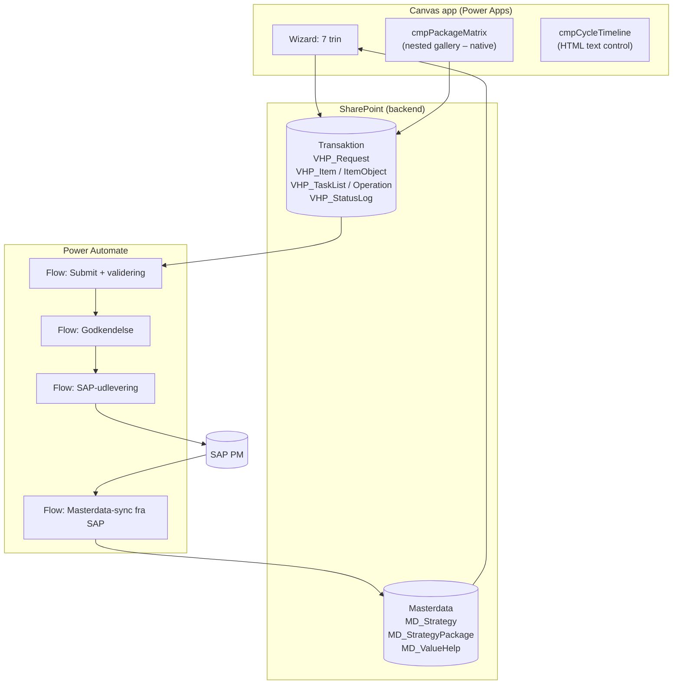
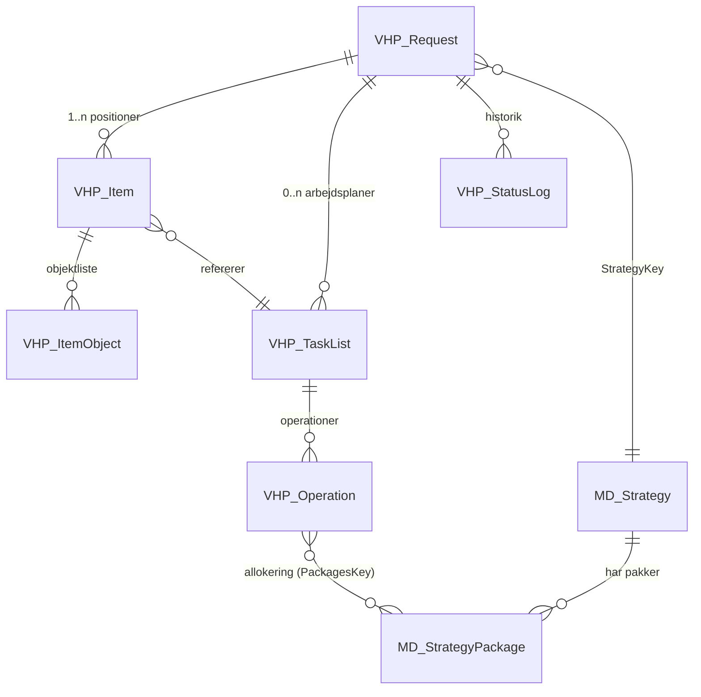
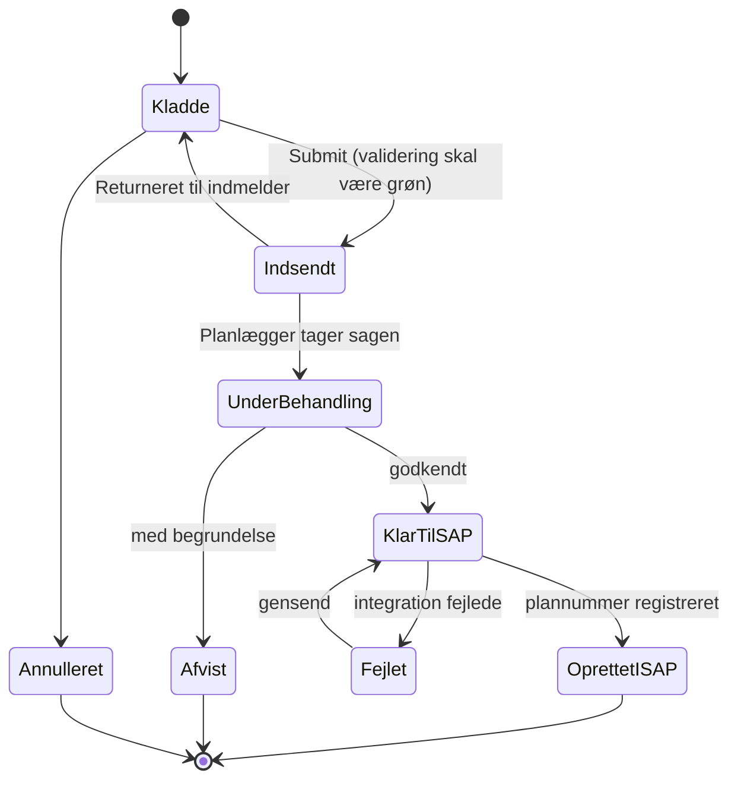

# Løsningsoplæg – VH-plans app med strategiplaner og pakker

> Status: oplæg til review. Alt i dette dokument er forslag, ikke besluttet.
> Åbne spørgsmål er samlet i afsnit 10.

## 1. Formål og scope

Appen skal tage imod **indmeldinger (requests)** fra brugere om oprettelse af nye
vedligeholdsplaner i SAP PM. Appen opretter **ikke** noget i SAP i sig selv —
den producerer en valideret, komplet og godkendt specifikation, som enten
nøgles manuelt af en planlægger eller sendes videre via en integration
(se `04-integration-sap.md`).

I scope:

| Plantype | SAP | Status |
|---|---|---|
| Single cycle plan | IP41 | Findes allerede i eksisterende app |
| **Strategiplan** | **IP42** | **Denne udvidelse** |
| Multiple counter plan | IP43 | Ikke i scope – men datamodellen spærrer det ikke |

## 2. Domæneforståelse – og hvorfor den styrer designet

Dette er det vigtigste afsnit. Den hyppigste fejl, når man bygger en
strategiplan-indmelding, er at lægge pakkerne det forkerte sted.

I SAP PM ligger de tre ting i **tre forskellige objekter**:

```
Vedligeholdsstrategi (IP11)        ← MASTERDATA. Ejer pakkerne.
  └── Pakke 1: 1 MON,  hierarki 1
  └── Pakke 2: 3 MON,  hierarki 2
  └── Pakke 3: 12 MON, hierarki 3

Arbejdsplan (IA01/IA05/IA11)       ← Ejer ALLOKERINGEN operation → pakke
  Header: strategi = Z-MONTH
  Op 0010 Smøring          [x] P1  [x] P2  [x] P3
  Op 0020 Vibrationsmåling [ ] P1  [x] P2  [x] P3
  Op 0030 Hovedeftersyn    [ ] P1  [ ] P2  [x] P3

Vedligeholdsplan (IP42)            ← Peger BARE på strategi + arbejdsplan
  Header: strategi = Z-MONTH (skal matche arbejdsplanens)
  Position 1: objekt = EQUI 10001234, arbejdsplan = A/GRP123/1
```

Tre konsekvenser for appen:

1. **Brugeren opfinder ikke pakker.** Pakker kommer fra strategien og er
   masterdata. Appen skal vise dem, ikke lade brugeren skrive dem.
   → Derfor listerne `MD_Strategy` / `MD_StrategyPackage`.

2. **Pakkematricen hører til arbejdsplanens operationer — ikke til planen.**
   Hvis brugeren peger på en *eksisterende* arbejdsplan, skal appen slet ikke
   bede om en matrix (allokeringen findes allerede i SAP). Matricen er kun
   relevant, når brugeren samtidig beder om en *ny* arbejdsplan.
   → Derfor feltet `VHP_Item.TaskListMode = Existing | New`.

3. **Strategien skal være den samme på plan og arbejdsplan.** Det er en
   hård valideringsregel, ikke en anbefaling.

### Single cycle vs. strategi – forskellen i datamodellen

En single cycle plan er matematisk en strategiplan med præcis én pakke.
Derfor bygger vi **én** datamodel og sætter `PlanType` som diskriminator,
i stedet for to parallelle strukturer. Det holder validering, payload og
UI på én kodebase.

| | Single cycle | Strategi |
|---|---|---|
| Cyklus | På planen (`SingleCycle_Length/Unit`) | På strategiens pakker |
| Pakker | Implicit én | 2–n fra `MD_StrategyPackage` |
| Planlægningsparametre | Indtastes på planen | Defaultes fra strategien, kan overskrives |
| Matrix nødvendig | Nej | Ja (kun ved ny arbejdsplan) |

## 3. Arkitekturoverblik



## 4. Komponentvalg: native canvas, HTML eller PCF?

Du spurgte specifikt til HTML-komponenten. Kort svar: **brug den til
visualisering, ikke til input.**

HTML text-kontrollen i canvas kan ikke sende events tilbage til appen. Den
kører ikke JavaScript, og den har ingen `OnSelect` pr. element. Alt, hvad
brugeren skal kunne *klikke*, skal derfor være rigtige canvas-kontroller.

| Behov | Anbefaling | Hvorfor |
|---|---|---|
| Pakkematrix (klikbare afkrydsninger) | **Nested gallery** (ydre = operationer, indre = pakker) | Tovejs, tilgængeligt, ingen ALM-overhead. Dynamiske kolonner løses af den indre gallery |
| Cyklus-/kaldsforhåndsvisning over 3–5 år | **HTML text control** | Umuligt i native kontroller, trivielt som HTML-tabel. Read-only, så begrænsningen gør ikke noget |
| Print-/godkendelsesresumé | **HTML text control** | Ét felt, pæn PDF via flow |
| Excel-paste af 200 operationer | PCF code component *(fase 2)* | Kun hvis behovet er reelt – koster solution-aware ALM |

Beslutning: **fase 1 = nested gallery + HTML til visualisering. Ingen PCF.**
Se `docs/03-canvas-app-design.md` for opbygningen og `powerfx/` for formlerne.

### Hvorfor ikke bare HTML til hele matricen?

Det virker kun med et hack (usynlige knapper lagt oven på HTML-gitteret),
som knækker, så snart antallet af pakker eller rækkehøjden ændrer sig.
Det er ikke værd at vedligeholde.

## 5. Datamodel i overblik

Detaljer med kolonne-for-kolonne i `docs/02-datamodel-sharepoint.md`.



### Den ene ikke-oplagte beslutning: pakkeallokeringen som streng

Allokeringen operation↔pakke er en mange-til-mange-relation. Den oplagte
modellering er en junction-liste (`VHP_OperationPackage`). Det fraråder jeg
som primær lagring:

- 25 operationer × 8 pakker = op til 200 rækker **pr. anmodning**.
  SharePoint har ingen transaktioner, så et delvist fejlet `ForAll(Patch(...))`
  efterlader en halv matrix. Oprydningen er ikke triviel.
- 200 skrivninger via connectoren tager 20–40 sekunder. Brugeren tror, appen
  er gået ned.
- Ingen af de forespørgsler, en junction-liste er god til, skal faktisk bruges
  i SharePoint — matricen læses altid i sin helhed for én anmodning.

**Anbefaling:** gem allokeringen som ét tekstfelt på operationsrækken,
`PackagesKey`, i formen `;1;3;5;` (med indledende og afsluttende separator,
så `;1;` aldrig matcher inde i `;12;`). Én skrivning pr. operation.

Hvis der senere opstår et reelt rapporteringsbehov ("hvilke operationer
ligger i pakke 3 på tværs af alle anmodninger?"), lader vi et flow
*materialisere* junction-listen ved submit. Så er den afledt data, der kan
genopbygges, og ikke noget appen skal holde konsistent i realtid.

## 6. Statusmodel



Regler:
- Kun `Kladde` er redigerbar for indmelderen.
- Ved overgang til `Indsendt` fryses et **JSON-snapshot** (`PayloadJson`) på
  anmodningen. Snapshottet, ikke de normaliserede lister, er det, integrationen
  sender. Så kan masterdata ændre sig bagefter uden at ændre, hvad der blev
  indsendt.
- Hver overgang skriver en række i `VHP_StatusLog`.

## 7. Validering

Valideringen skal køre **to steder**: i appen (hurtig feedback, delegerbar) og
i submit-flowet (autoritativ — appen kan omgås). Reglerne er de samme og er
specificeret som en tabel i `powerfx/03-validering.fx`, så de kan
genimplementeres 1:1 i flowet.

Kritiske regler, der er specifikke for strategiplaner:

| # | Regel | Niveau |
|---|---|---|
| S1 | `PlanType = Strategy` ⇒ `StrategyKey` udfyldt | Fejl |
| S2 | Strategien skal have ≥ 2 aktive pakker | Fejl |
| S3 | Arbejdsplanens strategi = planens strategi | Fejl |
| S4 | Hver operation skal ligge i mindst én pakke | Fejl |
| S5 | Hver pakke skal indeholde mindst én operation | Advarsel |
| S6 | Pakkernes cyklusenhed skal matche planlægningsindikatoren (tid vs. tæller) | Fejl |
| S7 | `CycleStartDate` skal være udfyldt og ikke i fortiden | Advarsel |
| S8 | Hvis performance-baseret: målepunkt skal findes på objektet | Fejl |
| S9 | Operation, der ligger i en lav pakke men ikke i en højere, bliver sprunget over ved hierarki-undertrykkelse | Advarsel |

Advarsler blokerer ikke submit, men skal kvitteres.

S9 er den, der er nemmest at overse og dyrest i drift. Ligger en operation i
den månedlige pakke, men ikke i årspakken, aflyser hierarki-undertrykkelsen
det månedlige kald den dag, årseftersynet forfalder — og operationen udføres
11 gange om året i stedet for 12, uden at nogen opdager det. Reglen gælder kun,
hvis hierarki-undertrykkelse er jeres semantik (åbent spørgsmål 1).

## 8. Hvad brugeren faktisk ser (wizard)

| Trin | Skærm | Vises kun ved |
|---|---|---|
| 1 | Plantype + hoveddata | altid |
| 2 | Cyklus (single) **eller** strategi + pakkeoverblik | altid |
| 3 | Positioner og tekniske objekter | altid |
| 4 | Arbejdsplan: eksisterende eller ny + operationer | altid |
| 5 | **Pakkematrix** | `PlanType = Strategy` og `TaskListMode = New` |
| 6 | Planlægningsparametre (defaultet fra strategien) | altid |
| 7 | Resumé, tidslinje-preview, validering, submit | altid |

Trin 5 springes altså helt over for single cycle-planer — det er den samme
wizard, ikke to apps.

## 9. Ikke-funktionelle forhold

- **Delegation.** SharePoint-lookup-kolonner kan ikke filtreres delegerbart på
  en robust måde. Derfor bruger alle relationer i transaktionslisterne et
  indekseret **talfelt** (`RequestId`, `TaskListId`, ...) i stedet for en
  lookup-kolonne. Det koster referentiel integritet, som vi i stedet håndhæver
  i appen og i et oprydningsflow.
- **5000-grænsen.** Indekser `RequestId`, `Status` og `Created` fra dag ét.
  Arkivér anmodninger med status `OprettetISAP` ældre end 12 måneder til en
  arkivliste via et månedligt flow.
- **Sikkerhed.** SharePoint-connectoren kører i brugerens kontekst, så
  listetilladelser gælder direkte. Sæt item-level permissions
  ("Read/Create items that were created by the user") på `VHP_Request` for
  indmeldergruppen; planlæggere får Contribute. Felter, kun systemet må skrive
  (`SapMaintPlanNo`, `IntegrationStatus`), skrives af flows med en
  service-connection.
- **ALM.** Solution-aware app, connection references, deployment via Power
  Platform Pipelines. SharePoint-listerne provisioneres med PnP-scriptet i
  `sharepoint/provision/`, så DEV/TEST/PROD er identiske.

## 10. Åbne spørgsmål – skal afklares før build

1. **Hierarki-semantik.** Når flere pakker forfalder samme dag: skal kun den
   højeste hierarkipakke kaldes (lavere undertrykkes), eller skal alle
   forfaldne pakkers operationer samles i ét ordre? Det afgør både
   forhåndsvisningen og hvordan brugerne skal krydse af. Bekræft med jeres
   PM-key user — forhåndsvisningen understøtter indtil videre begge, styret af
   en toggle.
2. **Bliver arbejdsplaner oprettet gennem denne app, eller findes de altid
   i forvejen?** Hvis de altid findes, kan trin 5 (matricen) udgå helt, og
   omfanget halveres.
3. **Masterdata-kilde.** Vedligeholdes strategier manuelt i SharePoint, eller
   skal de synkroniseres fra SAP? Sync er klart at foretrække, men kræver
   en læseadgang (RFC eller OData).
4. **Integrationsvej til SAP.** Se `04-integration-sap.md` — der er fire
   muligheder, og valget afhænger af jeres SAP-release og gateway-setup.
5. **Performance-baserede strategier** (tælleren, fx driftstimer/km) – skal de
   med i fase 1? De kræver målepunkt-validering på det tekniske objekt.
6. **Antal operationer pr. arbejdsplan i praksis.** Over ca. 50 bliver den
   native matrix træg, og PCF bliver relevant.
