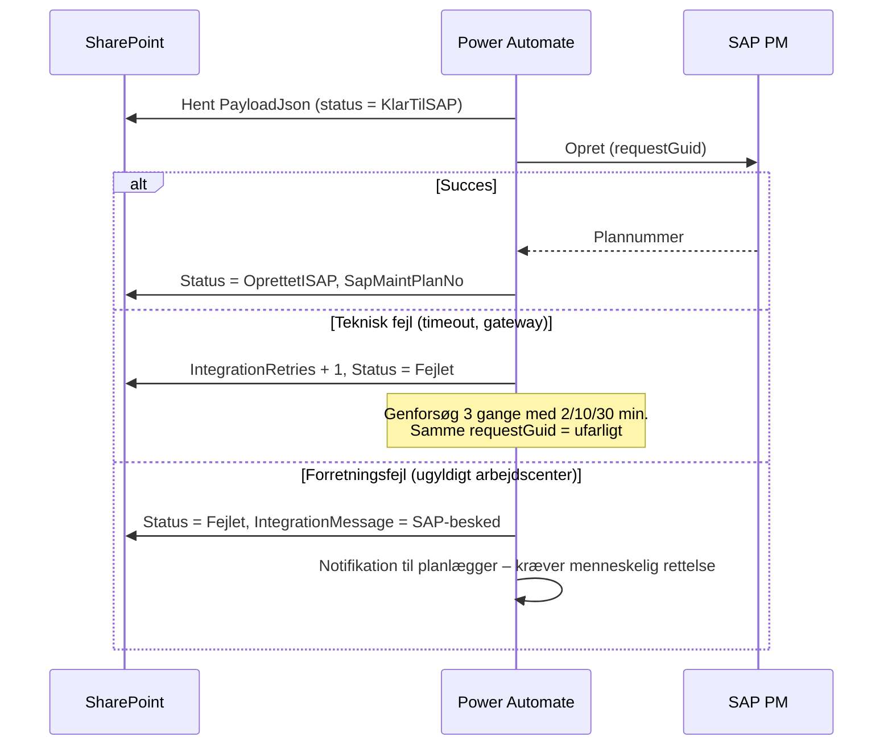

# Udlevering til SAP PM

> **Verificér før valg.** Hvilke API'er der faktisk findes hos jer, afhænger
> af release (ECC 6.x vs. S/4HANA, on-prem vs. cloud) og af hvad jeres
> Basis/integrationsteam har åbnet. Tallene og navnene nedenfor er
> udgangspunkter til en samtale med SAP-teamet, ikke bekræftede fakta om
> jeres landskab. Standard-BAPI-dækningen for **oprettelse af
> vedligeholdsplaner** er historisk tynd sammenlignet med fx ordrer
> (`BAPI_ALM_ORDER_MAINTAIN`), og det er den væsentligste årsag til, at
> mulighed A nedenfor er den realistiske start.

## Fælles for alle muligheder: kontrakten

Uanset transportvej er det **samme payload**, der sendes: JSON-snapshottet
fra `VHP_Request.PayloadJson`, beskrevet i `schema/vhplan-request.schema.json`
med et eksempel i `schema/example-strategy-request.json`.

Det er en bevidst beslutning. Integrationen kan skiftes ud senere uden at
røre app eller datamodel, fordi kontrakten ligger fast.

**Idempotens:** `requestGuid` er nøglen. Modtageren skal afvise en
genindsendelse med samme GUID, hvis planen allerede er oprettet, og i stedet
returnere det eksisterende plannummer. Uden det giver et netværkstimeout og
et retry to identiske planer i SAP. De første otte tegn af GUID'en skrives
desuden i planens sorteringsfelt, så planen kan findes tilbage fra SAP-siden.

---

## Mulighed A – manuel nøgling med genereret arbejdsseddel *(anbefalet start)*

Flowet sender ikke noget til SAP. Det producerer:

- en PDF med hele anmodningen (fra `cmpRequestSummary`-HTML'en via
  "Convert HTML to PDF"), og
- et Excel-ark med operationer og pakkematrix i præcis den kolonnerækkefølge,
  planlæggeren har foran sig i IA01/IP42.

Planlæggeren nøgler i SAP og skriver plannummeret tilbage i appen, hvorefter
status sættes til `OprettetISAP`.

| | |
|---|---|
| Fordele | Nul SAP-udvikling, nul gateway, kan være i drift om to uger. Værdien ligger allerede i struktureret indmelding, validering og godkendelse — ikke i automatikken |
| Ulemper | Manuelt arbejde består. Risiko for tastefejl mellem app og SAP |
| Skift senere | Kræver ingen ændringer i app eller datamodel |

Vær opmærksom på, at hvis I i praksis opretter 5–10 planer om måneden, er
mulighed A sandsynligvis også slutmålet. Automatisering betaler sig først
ved volumen.

---

## Mulighed B – Power Automate → custom RFC-wrapper *(on-prem ECC/S4)*

Et Z-funktionsmodul (`Z_PM_MAINTPLAN_CREATE`), RFC-enabled, som:

1. opretter arbejdsplan + operationer + pakkeallokering (BDC eller
   task-list-API),
2. opretter vedligeholdsplanen med strategi og positioner,
3. kører første planlægning (scheduling),
4. returnerer plannummer, arbejdsplangruppe og en beskedtabel.

Power Automate kalder det via **SAP ERP-connectoren**, som kræver en
**on-premises data gateway**.

| | |
|---|---|
| Fordele | Fuld kontrol. Wrapperen kan håndhæve jeres navngivnings- og nummerkonventioner ét sted |
| Ulemper | ABAP-udvikling og vedligehold. Gateway skal driftes. Fejlhåndtering skal designes (delvist oprettede objekter) |
| Kritisk | Wrapperen skal være **idempotent på `requestGuid`** og skal enten oprette alt eller rulle tilbage |

---

## Mulighed C – OData / SAP Integration Suite *(S/4HANA)*

Appens flow lægger payloaden på en kø (Service Bus eller en SharePoint-liste
som outbox), og SAP Integration Suite (CPI) henter, mapper og kalder
S/4HANA-API'erne.

> Undersøg på SAP Business Accelerator Hub, hvilke
> vedligeholdsplan-API'er der findes i **jeres** release, og om de dækker
> strategiplaner med pakkeallokering — ikke kun single cycle. Det er det
> spørgsmål, der afgør, om mulighed C overhovedet er farbar.

| | |
|---|---|
| Fordele | Ingen gateway. Integrationen ejes af integrationsteamet, ikke af Power Platform |
| Ulemper | Afhænger helt af API-dækningen. Længere leveranceforløb |

---

## Mulighed D – filbaseret masseindlæsning

Et ugentligt flow samler alle anmodninger i status `KlarTilSAP` i én fil
(LSMW/LTMC-format) og lægger den på et SFTP-drop.

| | |
|---|---|
| Fordele | Passer til organisationer, der allerede masseopretter planer. Ingen realtidsintegration |
| Ulemper | Latenstid på dage. Fejl opdages sent og batchvis |

---

## Anbefaling

**Start på A. Byg kontrakten som om det var B.**

Payload, `requestGuid`, `IntegrationStatus`, `IntegrationMessage` og
`IntegrationRetries` skal være på plads fra dag ét, også selvom det første
"integrationsflow" bare laver en PDF. Så er skiftet til B eller C en
udskiftning af ét flow — ikke et nyt projekt.

## Fejl- og retry-håndtering (gælder B, C, D)

Skelnen mellem teknisk og forretningsfejl er det, der afgør, om der skal
forsøges igen. Uden den skelnen ender I enten med at spamme SAP med
genforsøg på en fejl, der aldrig retter sig selv, eller med at opgive ved
den første netværksglitch.

## Masterdata den anden vej

`MD_Strategy` og `MD_StrategyPackage` bør synkroniseres **fra** SAP, ikke
vedligeholdes manuelt. Manuelt vedligeholdte strategier afviger fra SAP
inden for et halvt år, og så validerer appen mod noget, der ikke findes.

Et natligt flow, der læser strategier og pakker og laver upsert på
`Title`, er langt billigere end den fejlsøgning, afvigelsen ellers koster.
Samme flow kan fylde `MD_ValueHelp` med arbejdscentre, planlæggergrupper og
ordretyper pr. værk.
