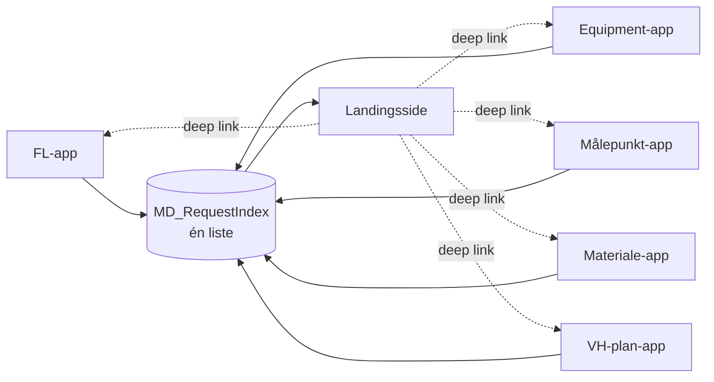

# Landingsside for SAP masterdata-indmeldinger

Afdelingen håndterer masterdata for **funktionspladser, udstyr, målepunkter,
materialer og VH-planer**. Hver af dem får sin egen indmeldingsapp. Dette
dokument beslutter, hvordan de bindes sammen.

## 1. Én app eller hub + satellitter?

**Anbefaling: hub + satellitter.** Jeres egen idé er den rigtige — men den
holder kun, hvis hubben læser **én** kilde. Gør den ikke det, bliver den
langsommere end den monolit, den skulle erstatte.

### Hvad der faktisk koster tid i en canvas app

| Omkostning | Monolit | Hub + satellitter |
|---|---|---|
| Antal datakilder der initialiseres ved start | Alle 5 domæners | Hubben: **1**. Satellitten: kun sine egne |
| Kontroller på første skærm | Alle domæners | Kun hubbens ~40 |
| `App.OnStart` | Summen af 5 apps | Ingen datahentning overhovedet |
| Skift mellem domæner | Øjeblikkeligt (`Navigate`) | **Ny cold start, 3–8 sek.** |
| Publish-risiko | Én fejl rammer alle 5 | Isoleret pr. app |
| Studio-oplevelse | ~1.500 kontroller | 5 × ~300 |

Det eneste sted monolitten vinder, er skift mellem domæner. Og det er
netop det, jeres brugere **ikke** gør: man kommer for at indmelde ét stykke
udstyr eller for at se status på sine sager. Ingen springer mellem
målepunkter og materialer i samme session.

Monolitten ville altså tvinge alle til at betale for alle fem domæner hver
gang — også når de kun skulle se en status.

### Det praktiske argument oveni

VH-plan-appen alene er 294 kontroller og 9.700 linjer genereret YAML. Fem af
den slags i én app er omkring 1.500 kontroller. Power Apps Studio bliver
tungt at arbejde i længe før det, og et publish ville sætte alle fem
indmeldingstyper på spil på én gang.

## 2. Den beslutning der afgør performance

> **Hubben må aldrig læse de fem domænelister.**

Den oplagte fejl er at lade landingssiden hente fra `VHP_Request`,
`EQ_Request`, `FL_Request` osv. og flette dem sammen i klienten. Det er fem
forbindelser, fem forespørgsler, og en fletning der **ikke kan delegeres** —
den knækker over 2.000 rækker og bliver langsommere for hver ny app.

I stedet: **én fælles indeksliste**, som alle fem apps skriver en
opsummeringsrække til, når status ændrer sig.



Hubben har dermed **én datakilde**, og alle dens forespørgsler er
delegerbare. Detaljerne bliver liggende i domænelisterne — indekset bærer kun
det, en oversigt skal bruge.

Prisen er, at hver app skal huske at opdatere sin indeksrække. Det hører
hjemme i **submit-flowet**, ikke i appen — så kan det ikke glemmes, og det
sker også når status ændres af en sagsbehandler.

## 3. `MD_RequestIndex`

| Kolonne | Type | Bemærkning |
|---|---|---|
| `Title` | Text Ⓘ | Anmodningsnr., fx `VHP-2026-00042` |
| `Domain` | Choice Ⓘ | `FunctionalLocation`, `Equipment`, `MeasuringPoint`, `Material`, `MaintenancePlan` |
| `RequestGuid` | Text Ⓘ | Nøglen der deep-linkes på |
| `Status` | Choice Ⓘ | Fælles ordforråd, se §4 |
| `StatusStep` | Number | 1–5. Hubben tegner forløbet uden at kende domænet |
| `IsOpen` | Yes/No Ⓘ | Sat af flowet sammen med `Status`. **Et indekseret boolsk felt er delegerbart; en række OR'ede statusværdier er det ikke** — og køen filtrerer på præcis dette felt |
| `RequesterEmail` | **Text** Ⓘ | **Ikke** en Person-kolonne — se nedenfor |
| `RequesterName` | Text | Kun til visning |
| `AssignedToEmail` | Text Ⓘ | Sagsbehandler |
| `ShortText` | Text(255) | Den menneskelæselige titel |
| `Plant` | Text(4) Ⓘ | |
| `ItemCount` | Number | Fx antal positioner |
| `SapObjectNo` | Text | Udfyldes når objektet findes i SAP |
| `SourceItemId` | Number | ID i domænelisten |
| `AppUrl` | Text(500) | Satellittens play-URL |
| `LastActionOn` | DateTime Ⓘ | Sorteringsnøgle |
| `LastActionBy` | Text | |

> **`RequesterEmail` skal være tekst, ikke Person.** Person-kolonner kan ikke
> filtreres delegerbart i SharePoint. Med en indekseret tekstkolonne er
> `Filter(MD_RequestIndex, RequesterEmail = User().Email)` delegerbart og
> virker uanset hvor mange rækker listen får. Det er den enkeltbeslutning,
> der holder hubben hurtig om tre år.

Indekser: `Domain`, `Status`, `IsOpen`, `RequesterEmail`, `AssignedToEmail`,
`LastActionOn`, `Plant`.

## 4. Fælles statusordforråd

Fem apps kan kun vises i én oversigt, hvis de bruger de samme statusværdier.

| Trin | Status | Betydning |
|---|---|---|
| 1 | `Kladde` | Kun synlig for indmelderen |
| 2 | `Indsendt` | Afleveret til masterdata |
| 3 | `UnderBehandling` | En sagsbehandler har taget den |
| 4 | `KlarTilSAP` | Godkendt, afventer oprettelse |
| 5 | `OprettetISAP` | Færdig, `SapObjectNo` udfyldt |
| – | `AfventerInfo` | Sendt retur til indmelder |
| – | `Afvist` | Lukket med begrundelse |
| – | `Annulleret` | Trukket tilbage af indmelder |

`StatusStep` bærer 1–5, så hubben kan tegne forløbet uden en `Switch` over
domænespecifikke værdier.

## 5. Landingssidens opbygning

**To målgrupper, ét skærmbillede.** Afdelingen er både modtager og
indmelder, så siden har en segmentvælger:

- **Mine indmeldinger** (standard) — det man selv har sendt
- **Til behandling** — køen: tildelt mig, og ikke-tildelte

Derunder:

1. **Fem domænefliser** med "Opret ny" og et tal for egne åbne sager.
2. **Én samlet liste** på tværs af domæner med domænebadge, nummer,
   kort tekst, værk, statuspille med trin, og hvornår der sidst skete noget.
3. **Filtre**: domæne, status, fritekst. Alle delegerbare.

Et klik på en række åbner den rigtige satellitapp på den rigtige sag.

## 6. Deep linking

Satellittens URL gemmes i indeksrækken, så hubben ikke skal kende fem
app-id'er:

```powerfx
Launch(
    ThisItem.AppUrl & "&reqid=" & ThisItem.RequestGuid,
    { },
    LaunchTarget.New
)
```

Satellitten læser den i `App.OnStart`:

```powerfx
Set(gblIncomingRequestGuid, Param("reqid"))
```

**Åbn i ny fane (`LaunchTarget.New`).** Så bliver hubben liggende indlæst, og
vejen tilbage koster ikke en ny cold start. Det er den billigste afbødning af
den eneste omkostning, arkitekturen har.

## 7. Performanceregler for hubben

Disse er ikke generelle råd — de er de konkrete ting, der afgør, om
landingssiden åbner på under to sekunder.

1. **Ingen datahentning i `App.OnStart`.** Brug named formulas og bind
   galleriet direkte til et delegerbart `Filter`. `OnStart` betales af hver
   bruger hver gang.
2. **Én datakilde.** Kun `MD_RequestIndex`.
3. **Filtrér kun på indekserede tekst-, tal- og choice-kolonner.** Aldrig på
   Person eller Lookup.
4. **Ingen `Search()` over mange kolonner** i galleriets `Items` — den er ikke
   delegerbar. Brug `StartsWith` på én kolonne.
5. **Ingen `AddColumns` i `Items`.** Beregn i etiketterne i stedet.
6. **Fliseantallene** læses fra én lille samling af egne åbne sager
   (typisk under 50 rækker), ikke fem `CountRows(Filter(...))` mod hele
   listen.
7. **Ingen Timer-baseret auto-refresh.** En eksplicit opdateringsknap med
   `Refresh(MD_RequestIndex)`.
8. **Ingen billeder.** Brug ikoner og farvede pille-etiketter.
9. **Arkivér.** Et månedligt flow flytter `OprettetISAP` ældre end 12 måneder
   til `MD_RequestIndexArchive`. Hubben bliver aldrig tungere med tiden.

## 8. Faser

| Fase | Indhold |
|---|---|
| 1 | `MD_RequestIndex` med indekser, og VH-plan-appen skriver sin række |
| 2 | Landingssiden med "Mine indmeldinger" og de fem fliser |
| 3 | "Til behandling"-visningen |
| 4 | De øvrige fire apps skriver deres indeksrækker efterhånden som de bygges |
| 5 | Arkiveringsflow |

Landingssiden kan altså stå færdig, mens kun ét domæne findes — de andre
fliser viser bare "Kommer snart", og listen fyldes efterhånden.

## 9. Hvad der taler imod, og hvornår man skal skifte mening

Hub + satellitter koster én cold start, når man springer fra oversigten ind i
en sag. Det er mærkbart, og det er den reelle pris.

Skulle det vise sig, at folk **rutinemæssigt** arbejder på tværs af flere
domæner i samme session, falder argumentet, og så er en monolit med
lazy-loadede skærme bedre. Det kan måles: Power Platform-analytics viser
sessionslængde og skift pr. session. Tag beslutningen på de tal efter et
kvartal frem for på en fornemmelse.
