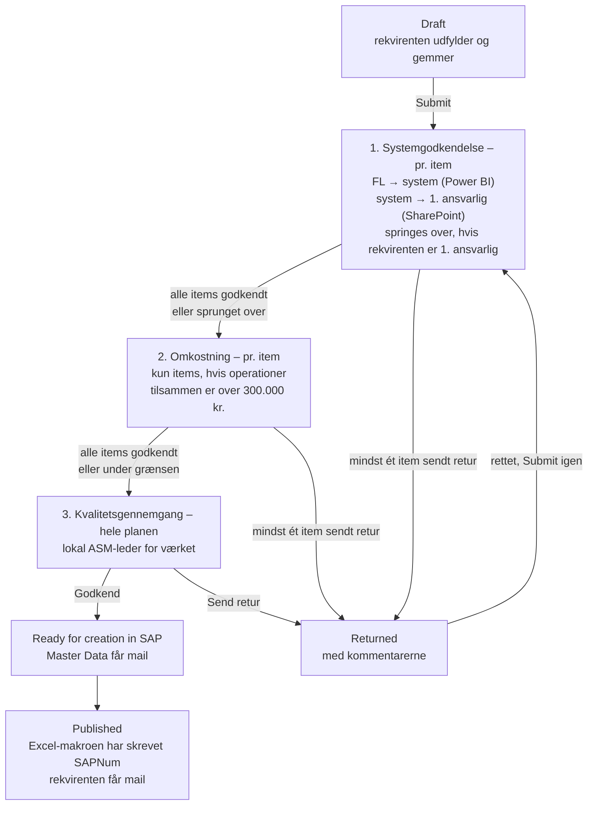

# Godkendelsesflow for nye VH-planer

> Status: **oplæg, rettet efter andet review**. Grundlaget er procesdiagrammet
> *Opret ny VH-plan for eksisterende anlæg (BIO-DK)*, niveau 4, ændret
> 17-09-2026. Beslutningerne fra reviewene står i §2. Det, der stadig er
> åbent, står i §12. Intet her er bygget endnu.

## 1. Kort svar: kan det sættes op ud fra SharePoint-listerne?

**Ja, men ikke med SharePoints indbyggede godkendelse.** Det skal være
Power Automate-flows, der trigges af ændringer i `MaintenancePlans`.

SharePoints egen *Configure approvals* på en liste er ét trin med faste
godkendere. Den kan ikke:

- vælge godkender pr. item ud fra system, beløb eller værk,
- køre flere trin efter hinanden med forskellige roller,
- slå noget op i en Power BI-model eller en anden liste,
- sende en sag retur med en kommentar, så den kan rettes og sendes igen.

Den lægger desuden sine egne kolonner på listen, som ikke kan slettes igen
fra brugerfladen.

Det, der **kan** bruges fra SharePoint-siden, er triggeren *When an item is
created or modified* på `MaintenancePlans` med **trigger conditions**. Så er
det kolonner på planen, som appen og flowene skriver, der styrer forløbet.
Godkendelserne sendes med Power Automates **Approvals**-connector. De lander
i Teams (Approvals-appen) og som mail med knapper, og der er historik på,
hvem der svarede hvad og hvornår.

## 2. Beslutninger fra reviewene

| # | Beslutning | Betyder for løsningen |
|---|---|---|
| 1 | Kun **300.000 kr.** er en grænse, og den skal være en parameter. Godkendelsen sker **efter planen er gemt** | Grænsen står i `AppSettings`. Godkendelsen starter ved **Submit** (se nedenfor) |
| 2 | ZEXO NIR og "dato efter 1/8" udgår | Ingen port for det i appen |
| 3 | Omkostningen er **pr. udførelse** | Summen af én gennemførelse af tasklisten, ikke ganget med cyklusser |
| 4 | Godkendere kan kun **sende retur**, ikke afvise endeligt | Ingen `Rejected`-status. Alle trin ender i *Godkend* eller *Send retur* |
| 5 | Omkostning godkendes af **én person**. Kvalitet godkendes **pr. værk** | To rækketyper i `MD_ApprovalRole` |
| 6 | Den, der udfylder appen, **er rekvirenten**. Er det ikke System Manageren, skal **System Manageren for systemet** godkende. Systemet bestemmes af Functional Location og slås op i en **Power BI semantisk model** | Nyt første trin: systemgodkendelse. Rekvirenten er planens opretter; der kommer ikke et ekstra felt |
| 7 | **Systemgodkendelse og omkostningsgodkendelse sker pr. item** | Én godkendelse pr. item, ikke pr. plan. Omkostningen er summen af det enkelte items operationer |
| 8 | System Managerne står i en **SharePoint-liste** med **1. og 2. ansvarlig** som initialer. **1. ansvarlig godkender**. E-mailen er initialer + `@orsted.com` | Power BI-modellen giver kun FL → system. Listen giver system → ansvarlige |
| 9 | Alle priser i `TaskListMain` er i **DKK** | Ingen omregning |

"Efter planen er gemt" er læst som **Submit**. Godkendelsen starter altså
ikke ved hver *Save draft*. En kladde gemmes mange gange, og hver gang
skrives items og operationer forfra, så beløbet ville ændre sig under en
åben godkendelse.

## 3. Forløbet



Et trin er først færdigt, når **alle** items har svaret. Sender én
godkender sit item retur, venter flowet stadig på de andre. Så får
rekvirenten alle kommentarer på én gang og skal ikke indsende tre gange for
at høre dem.

Sammenholdt med procesdiagrammet: trin 1 er nyt og dækker, at en anden end
System Manageren udfylder. Trin 2 og 3 er diagrammets *Godkend ny VH-plan* og
*Gennemgå kvaliteten af den nye VH-plan*. Omkostningen godkendes efter
planen er beskrevet, fordi det først er der, at tasklisterne og dermed
beløbene findes. *Opret ny VH-plan i SAP* er en opgave hos Master Data, ikke
en godkendelse. Den afsluttes af Excel-makroen, som allerede skriver
`SAPNum` og `Status = Published` tilbage.

## 4. 2. ansvarlig

Ja, 2. ansvarlig kan få godkendelsen, når feltet er udfyldt i listen. Der er
tre måder, og det er den første, jeg anbefaler:

| Måde | Sådan virker det | Vurdering |
|---|---|---|
| **A. Begge får den, første svar tæller** *(anbefalet)* | Er 2. ansvarlig udfyldt, sendes godkendelsen til begge som **Approve/Reject – First to respond**. Teksten siger, at 1. ansvarlig er den primære, og at 2. ansvarlig er stedfortræder | Enkel, og en sag står aldrig stille, fordi én er på ferie. Prisen er, at 2. ansvarlig *kan* svare, selvom 1. ansvarlig er til stede |
| B. 2. ansvarlig ved fravær | Listen får en ekstra kolonne, fx `Ansvarlig1Fraværende` (Ja/Nej). Er den Ja, går godkendelsen kun til 2. ansvarlig | Præcis, men afhænger af, at nogen husker at sætte og fjerne markeringen |
| C. Eskalering efter X dage | Godkendelsen går til 1. ansvarlig. Er der ikke svaret efter fx 3 arbejdsdage, sendes en ny til 2. ansvarlig | **Frarådes.** Et flow kan ikke selv annullere den første godkendelse – det kan kun gøres manuelt i Power Automate. Den første bliver derfor liggende åben hos 1. ansvarlig, og svarer vedkommende på den bagefter, bliver svaret ikke brugt |

Uanset måde kan 1. ansvarlig selv **videresende** en godkendelse til en
anden person i Power Automate (*Approvals* → *Reassign*).

**Hvem er rekvirent-undtagelsen?** Trinnet springes kun over, hvis
rekvirenten er **1. ansvarlig**. Udfylder 2. ansvarlig selv appen, går
godkendelsen til 1. ansvarlig, fordi det er 1. ansvarlig, der godkender.

## 5. Statusmodellen

`MaintenancePlans.Status` bevarer sine fire værdier og får én ny.
Undervejs i godkendelserne står planen i `In Progress`. Det trin, den er
nået til, står i en ny kolonne, `ApprovalStage`.

| `Status` | `ApprovalStage` | Ligger hos | `MD_RequestIndex.Status` | Step |
|---|---|---|---|:-:|
| `Draft` | *(tom)* | Rekvirenten | `Kladde` | 1 |
| `In Progress` | `System` | System Managere | `Indsendt` → `UnderBehandling` | 2 → 3 |
| `In Progress` | `Cost` | Omkostningsgodkender | `UnderBehandling` | 3 |
| `In Progress` | `Quality` | Lokal ASM-leder | `UnderBehandling` | 3 |
| `Ready for creation in SAP` | `Done` | Master Data | `KlarTilSAP` | 4 |
| `Published` | `Done` | – | `OprettetISAP` | 5 |
| **`Returned`** *(ny)* | *(tom)* | Rekvirenten | `AfventerInfo` | – |

Hvorfor en ekstra kolonne og ikke flere statusværdier: Excel-makroen,
hubben og den eksisterende mail kender allerede de fire værdier. Tre nye
"In Progress"-varianter ville skulle læres alle tre steder. `ApprovalStage`
læses kun af flowene og appens statusbanner.

## 6. Nye kolonner og lister

Tekst og tal frem for Person og Lookup, af samme grund som i resten af
datamodellen (`02-datamodel-sharepoint.md`): de kan filtreres delegerbart og
bruges i trigger conditions.

### Hvorfor godkendelserne ikke gemmes på `MaintenanceItems`

Det oplagte ville være en godkendelseskolonne pr. item. Det holder ikke:
appen **sletter og genopretter** alle items og operationer, hver gang
planen gemmes (`build_save.py`, "ryd det gamle"). Et item får derfor nyt
`ID` og nyt `ItemID` ved hver gem, og en kolonne på itemet ville forsvinde.

I stedet gemmes hver beslutning i `MD_ApprovalLog` med et **fingeraftryk**
af det, der blev godkendt (§7.1 og §7.2). Er fingeraftrykket det samme ved
næste indsendelse, er itemet allerede godkendt.

### `MaintenancePlans`

| Kolonne | Type | Skrives af | Bemærkning |
|---|---|---|---|
| `ApprovalStage` | Choice `System`, `Cost`, `Quality`, `Done` Ⓘ | App sætter `System` ved Submit. Flowene sætter resten | |
| `SubmittedOn` | DateTime | App ved Submit | Afgrænser "denne indsendelse" i loggen, se §7.3 |
| `StageRunId` | Text | Flow | Kørslen, der ejer trinnet lige nu. Spærre mod dobbeltkørsel, se §7 |
| `ReturnComment` | Note | Flow | Kommentarerne ved *Send retur*, én linje pr. item. Vises i appen |
| `RequesterNotified` | Yes/No | Flow | Spærre, så rekvirenten kun får én mail ved oprettelsen |

`Status` får valget `Returned`.

### System Manager-listen *(findes/oprettes af jer)*

Navnet er ikke kendt endnu; her kaldt `MD_SystemResponsible`.

| Kolonne | Type | Bemærkning |
|---|---|---|
| `System` | Text Ⓘ | Samme værdi, som Power BI-modellen returnerer for et FL |
| `Ansvarlig1` | Text | Initialer, fx `PKBJE` |
| `Ansvarlig2` | Text | Initialer. Må være tom |

Flowet laver e-mailen som `toLower(concat(trim(Ansvarlig1), '@orsted.com'))`.

Initialer er ikke det samme som en gyldig adresse. Hvis nogen har en anden
alias, eller har forladt virksomheden, lander godkendelsen ingen steder.
Flowet slår derfor adressen op med **Office 365 Users – Get user profile
(V2)**, før godkendelsen sendes. Findes den ikke, bruges 2. ansvarlig. Findes
ingen af dem, sendes planen retur med "System XYZ har ingen gyldig
ansvarlig i listen", og der går en mail til listens ejer.

### `MD_ApprovalRole` *(ny liste)*

| Kolonne | Type | Bemærkning |
|---|---|---|
| `Title` → `Role` | Text Ⓘ | `CostApprover`, `LokalAsmLeder` eller `MasterDataSap` |
| `Plant` | Text(4) Ⓘ | Tom for `CostApprover` og `MasterDataSap`. Udfyldt for `LokalAsmLeder` |
| `ApproverEmail` | Text | Én person, eller en mailaktiveret gruppe for Master Data |
| `IsActive` | Yes/No Ⓘ | |

### `MD_ApprovalLog` *(ny liste)* – revisionsspor og hukommelse

| Kolonne | Type | Bemærkning |
|---|---|---|
| `RequestGuid` | Text Ⓘ | |
| `PlanId` | Number Ⓘ | |
| `Stage` | Text Ⓘ | `System`, `Cost`, `Quality`, `SapCreated` |
| `ItemText` | Text | Itemets korttekst og FL, til visning |
| `Fingerprint` | Text Ⓘ | Se §7.1 og §7.2. Tom for `Quality` |
| `Decision` | Text | `Approve`, `Return`, `Skipped` |
| `Detail` | Text | Fx systemet, beløbet eller grunden til `Skipped` |
| `DecidedByEmail` / `DecidedOn` | Text / DateTime | |
| `Comment` | Note | |

Brugerne har **kun læseadgang**. Flowene skriver med en serviceforbindelse.
Det er vigtigt, fordi SharePoint-connectoren i appen kører som brugeren: en
bruger med skriveadgang til `MaintenancePlans` kan i princippet selv sætte
`ApprovalStage = Quality`. Kvalitetsflowet tjekker derfor loggen, før det
sender noget videre (§7.3).

`Skipped` logges også, med grunden i `Detail` ("rekvirent er 1. ansvarlig",
"184.200 kr."). Så kan man bagefter se, *hvorfor* et item ikke blev
godkendt af nogen. Appen kan vise loggen pr. item.

### Parametre i `AppSettings`

`AppSettings` har allerede `Option`/`Value` pr. miljø.

| `Option` | `Value` |
|---|---|
| `CostApprovalThresholdDkk` | `300000` |
| `EmailDomain` | `orsted.com` |

## 7. Flowene

Tre godkendelsesflows, ét pr. trin, og to mailflows. Alle trigges af
**SharePoint – When an item is created or modified** på `MaintenancePlans`.

**Hvorfor ét flow pr. trin og ikke ét langt:** et flow kan højst køre 30
dage, inklusive ventende godkendelser. Tre trin efter hinanden kan ramme
det. Med ét flow pr. trin starter hver ventetid forfra.

Fælles for dem:

- **Trigger condition + `StageRunId` som spærre.** Flowet skriver sin egen
  kørsels-id (`workflow()?['run']?['name']`) i `StageRunId`, så snart det
  starter. Den ændring trigger flowet igen, men nu er betingelsen falsk, så
  der opstår ingen løkke. Uden spærren ville hver ændring på planen under
  en åben godkendelse sende nye.
- **Concurrency = 1** på triggeren og et `Get item` som første handling.
- **Items behandles parallelt.** `Apply to each` over items med
  concurrency (fx 10). Hver gennemløb laver sin egen
  godkendelse (*Create an approval* + *Wait for an approval*). Løkken er
  først færdig, når alle har svaret.
- **Næste trin:** svarede alle *Godkend* (eller blev sprunget over), sætter
  flowet `ApprovalStage` til næste trin og tømmer `StageRunId`. Det trigger
  næste flow.
- **Send retur:** sendte mindst ét item retur, bliver `Status = Returned`,
  `ApprovalStage` tømmes, `ReturnComment` får én linje pr. returneret item,
  og rekvirenten får mail.
- **Timeout** `P14D` på *Wait*. Ved timeout: påmindelse, og `StageRunId`
  tømmes. Så starter samme flow forfra. De items, der nåede at blive
  godkendt, står i loggen og sendes ikke igen.
- **Indeksrækken:** hvert flow opdaterer `MD_RequestIndex` og sætter
  `AssignedToEmail` (§10).
- **Ejer:** en servicekonto eller et solution-flow med connection
  references, ikke en navngiven bruger.

### 7.1 F1 `BioSap-VhPlan-SystemApproval` – pr. item

```
@and(
  equals(triggerOutputs()?['body/Status/Value'], 'In Progress'),
  equals(triggerOutputs()?['body/ApprovalStage/Value'], 'System'),
  empty(triggerOutputs()?['body/StageRunId'])
)
```

1. `Get items` på `MaintenanceItems` med `MaintenancePlanNo/Id eq <ID>`.
2. **Én** Power BI-forespørgsel med alle planens FL'er → FL og system (§8).
   Ét kald for hele planen, ikke ét pr. item.
3. **Én** `Get items` på System Manager-listen for de fundne systemer.
4. For hvert item, parallelt:
   - **Fingeraftryk** = `System|FL|korttekst`.
   - Findes der i loggen en `Approve` for `Stage = System` på samme plan
     med samme fingeraftryk → log `Skipped` med "godkendt tidligere".
   - Er rekvirenten (planens *Created By*) **1. ansvarlig** for systemet →
     log `Skipped`.
   - Ellers: godkendelse til 1. ansvarlig (og 2. ansvarlig, efter §4).
     Detaljerne har itemets korttekst, FL, system og operationerne.
5. Alle godkendt eller sprunget over → `ApprovalStage = Cost`.

Fingeraftrykket gør, at en genindsendelse efter *Send retur* kun sender de
items igen, der er nye eller har fået et andet FL eller en anden tekst.

Findes et FL ikke i modellen, sendes planen **retur** med forklaringen
"FL XYZ findes ikke i systemmodellen". Et item må ikke glide igennem uden
godkendelse.

### 7.2 F2 `BioSap-VhPlan-CostApproval` – pr. item

Samme trigger condition med `ApprovalStage = 'Cost'`.

1. `Get items` på `MaintenanceItems` og på `TaskListMain` med
   `MaintenancePlanID/Id eq <ID>` – ét kald hver.
2. For hvert item: total = `sum` af `Price` for de operationer, hvis
   `MaintenanceItemNo/Id` er itemets `ID`.
3. For hvert item, parallelt:
   - Total ≤ `CostApprovalThresholdDkk` → log `Skipped` med beløbet.
   - **Fingeraftryk** = `FL|korttekst`. Findes der i loggen en `Approve` for
     `Stage = Cost` med samme fingeraftryk og et beløb **større end eller
     lig med** det nye → log `Skipped` med "godkendt tidligere". Et
     godkendt beløb gælder, så længe itemet ikke bliver dyrere.
   - Ellers: godkendelse til `CostApprover` med itemets total, grænsen og
     de dyreste operationer.
4. Alle godkendt eller sprunget over → `ApprovalStage = Quality`.

Beløbet regnes af flowet og ikke af appen, så det er det gemte, der
godkendes, og ingen kan skrive et andet tal ind.

### 7.3 F3 `BioSap-VhPlan-QualityReview` – hele planen

Samme trigger condition med `ApprovalStage = 'Quality'`.

1. **Værn:** har hvert item efter `SubmittedOn` en `Approve`- eller
   `Skipped`-række for både `System` og `Cost` i `MD_ApprovalLog`? (En
   godkendelse fra en tidligere indsendelse, som blev genbrugt via
   fingeraftrykket, logges også som `Skipped` med "godkendt tidligere".)
   Hvis ikke → sæt `ApprovalStage = System` og stop. Så køres de to trin
   igen i stedet for at blive sprunget over.
2. Én godkendelse til `LokalAsmLeder` for planens værk (`PlantsInitial`).
3. *Godkend* → `Status = Ready for creation in SAP`, `ApprovalStage = Done`.

### 7.4 F4 `BioSap-VhPlan-ToMasterData`

```
@and(
  equals(triggerOutputs()?['body/Status/Value'], 'Ready for creation in SAP'),
  not(equals(triggerOutputs()?['body/InitialEmailSent'], true))
)
```

Det er mailen fra [`17-flow-email.md`](17-flow-email.md) (*"VH-plan …
sendt til oprettelse"*). Den flyttes fra `In Progress` til `Ready for
creation in SAP`, går til `MasterDataSap` og sætter `InitialEmailSent =
true`, som listen allerede har.

### 7.5 F5 `BioSap-VhPlan-Created`

```
@and(
  equals(triggerOutputs()?['body/Status/Value'], 'Published'),
  not(equals(triggerOutputs()?['body/RequesterNotified'], true))
)
```

Mail til rekvirenten med `SAPNum`, `RequesterNotified = true`, log,
indeksrækken → `OprettetISAP`, `SapObjectNo = SAPNum`, `IsOpen = false`.

## 8. Opslaget i Power BI

Modellen skal kun svare på én ting: **hvilket system hører et FL til.** De
ansvarlige kommer fra SharePoint-listen.

Power BI-connectoren i Power Automate har handlingen **Run a query against
a dataset**. Den sender en DAX-forespørgsel til den semantiske model via
REST-API'et *Execute Queries* og får rækkerne tilbage som JSON.

### Forespørgslen

Tabel- og kolonnenavne er pladsholdere, indtil modellen er kendt (§12).
FL-listen bygges i flowet af punkt 1 i §7.1.

```dax
EVALUATE
SELECTCOLUMNS (
    FILTER (
        'FunctionalLocation',
        'FunctionalLocation'[FunctionalLocation]
            IN { "SSV10 KAB10AP001", "SSV10 KAB10AP002" }
    ),
    "FL", 'FunctionalLocation'[FunctionalLocation],
    "System", 'FunctionalLocation'[System]
)
```

Tre ting at vide:

- **Nøglerne i svaret har klammer.** Kolonnen `"System"` kommer tilbage som
  `[System]`, så i flowet hedder det `item()?['[System]']`.
- **Anførselstegn i et FL skal fordobles**, før det sættes ind i
  `IN { … }`: `replace(item(), '"', '""')`. Ellers kan et FL ødelægge
  forespørgslen.
- **Trim og versaler** på begge sider af sammenligningen, ligesom appen
  gemmer FL'er.

### Forudsætninger

| | |
|---|---|
| Tenant-indstilling | **Dataset Execute Queries REST API** (Developer settings) skal være slået til for flowets konto |
| Rettigheder | Flowets konto skal have **Build** og **Read** på den semantiske model |
| Grænser | 100.000 rækker og 1.000.000 værdier pr. forespørgsel. En plan har få FL'er, så det er langt fra |
| Kapacitet | Virker på Pro, PPU og Premium/Fabric |
| RLS | Har modellen row-level security, ser flowets konto kun sine egne rækker. Kontoen skal have adgang til alle FL'er |

Modellen opdateres efter sin egen tidsplan. Et FL, der lige er oprettet i
SAP, er måske ikke kommet med endnu. Det er grunden til, at et ukendt FL
sender planen retur med en forklaring i stedet for at fejle stille.

## 9. Ændringer i appen

Alt sker i builderne i `Maintenance Plan App/build/`. Kolonnenavnene lægges
i `sp_config.py`, som alle andre.

| Hvor | Ændring |
|---|---|
| `save_action(submit=True)` (`build_save.py`) | Skriver også `ApprovalStage: { Value: "System" }` og `SubmittedOn: Now()`, og tømmer `StageRunId`. Ved genindsendelse fra `Returned` gøres det samme |
| `save_action` | Skriver **aldrig** `StageRunId` eller `ReturnComment` |
| Totalen pr. item (`conVhpOpsTotalsHtml` i `build_tasklist.py`) | Viser allerede summen for det aktive item. Nyt: en markering "Over 300.000 kr. – kræver omkostningsgodkendelse", når den er over grænsen fra `AppSettings`. Kun information; flowet regner selv |
| Items-skinnen | Pr. item et lille mærke med systemgodkendelse og omkostningsgodkendelse, læst fra `MD_ApprovalLog` på `RequestGuid` |
| Statusbanner i toppen | Hvor sagen er (`ApprovalStage`), hvem den ligger hos, og `ReturnComment` ved `Returned` |
| Skrivebeskyttelse | Alle felter låses, når `Status` ikke er `Draft` eller `Returned` |
| Knapperne | *Save draft* og *Submit* er deaktiveret i samme tilfælde |

## 10. Hubben

*Til behandling* filtrerer i forvejen på `AssignedToEmail`. Et felt kan kun
rumme én person, og i trin 1 og 2 kan der være flere godkendere på én gang.
Feltet sættes derfor til den første åbne godkender. Det er godkendelserne i
Teams og mailen, der er det sted, man svarer; hubben er et overblik.

## 11. Rækkefølge

| Fase | Indhold | Hvorfor i den rækkefølge |
|---|---|---|
| 1 | PnP-script: nye kolonner, `Returned` i `Status`, `MD_ApprovalRole`, `MD_ApprovalLog`, `AppSettings`-rækkerne | Alt andet afhænger af det |
| 2 | Adgang til Power BI-modellen: tenant-indstilling og Build-rettighed. Test DAX-forespørgslen i DAX query view. System Manager-listen udfyldes | Den længste ventetid ligger typisk hos andre |
| 3 | F4 og F5 | Virker på statusværdier, appen og makroen allerede skriver |
| 4 | Appen: `ApprovalStage` ved Submit, statusbanner, låsning, `Returned` | |
| 5 | F2 og F3, derefter F1 | F1 afhænger af fase 2 |

Test i DEV med testbrugere i hver rolle og en testplan med tre items: ét
på et system, hvor rekvirenten er 1. ansvarlig; ét på et andet system; og
ét med operationer for over 300.000 kr.

## 12. Stadig åbent

1. **Power BI-modellen** (du finder den): workspace, model, tabel og
   kolonnenavne for FL og system. Findes alle FL-niveauer i modellen, eller
   skal flowet matche på en del af FL'en?
2. **System Manager-listen:** navn, og findes den allerede? Står systemet
   med præcis samme stavning som i Power BI-modellen?
3. **2. ansvarlig:** A, B eller C i §4? Oplægget er skrevet til A.
4. **Rekvirent = 2. ansvarlig:** skal trinnet også springes over, når
   rekvirenten er 2. ansvarlig? Oplægget siger nej, så 1. ansvarlig altid
   godkender.
5. **Datakaldt plan og servicekontrakt** (diagrammets trin 5 og 7) er ikke
   med i oplægget. Skal appen have felter til dem, eller er de uden for
   appen?
6. **Eksisterende planer** i `In Progress` uden `ApprovalStage`: skal de
   igennem forløbet, eller markeres de `Done` ved idriftsættelsen?
7. **Omkostningsgodkenderen:** hvem er det, og hvem er stedfortræder ved
   ferie? Det står i `MD_ApprovalRole`, så det kan skiftes uden at røre
   flowet.
