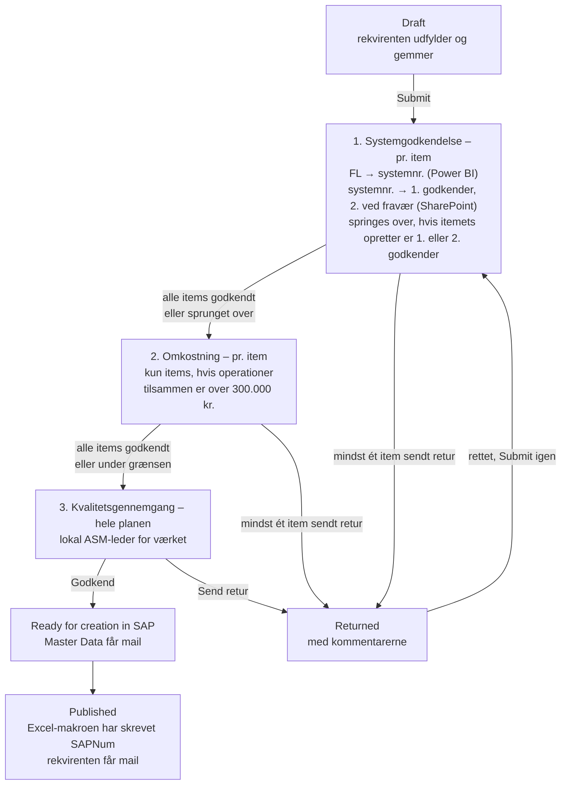

# Godkendelsesflow for nye VH-planer

> Status: **oplæg, rettet efter tredje review**. Grundlaget er procesdiagrammet
> *Opret ny VH-plan for eksisterende anlæg (BIO-DK)*, niveau 4, ændret
> 17-09-2026. Beslutningerne fra reviewene står i §2. Det, der stadig er
> åbent, står i §12. Intet her er bygget endnu.

## 1. Kort svar: kan det sættes op ud fra SharePoint-listerne?

**Ja, men ikke med SharePoints indbyggede godkendelse.** Det skal være
Power Automate-flows, der trigges af ændringer i `MaintenancePlans`.

SharePoints egen *Configure approvals* på en liste er ét trin med faste
godkendere. Den kan ikke:

- vælge godkender pr. item ud fra system, beløb eller værk,
- køre flere trin efter hinanden med forskellige roller,
- slå noget op i en Power BI-model eller en anden liste,
- sende en sag retur med en kommentar, så den kan rettes og sendes igen.

Den lægger desuden sine egne kolonner på listen, som ikke kan slettes igen
fra brugerfladen.

Det, der **kan** bruges fra SharePoint-siden, er triggeren *When an item is
created or modified* på `MaintenancePlans` med **trigger conditions**. Så er
det kolonner på planen, som appen og flowene skriver, der styrer forløbet.
Godkendelserne sendes med Power Automates **Approvals**-connector. De lander
i Teams (Approvals-appen) og som mail med knapper, og der er historik på,
hvem der svarede hvad og hvornår.

## 2. Beslutninger fra reviewene

| # | Beslutning | Betyder for løsningen |
|---|---|---|
| 1 | Kun **300.000 kr.** er en grænse, og den skal være en parameter. Godkendelsen sker **efter planen er gemt** | Grænsen står i `AppSettings`. Godkendelsen starter ved **Submit** (se nedenfor) |
| 2 | ZEXO NIR og "dato efter 1/8" udgår | Ingen port for det i appen |
| 3 | Omkostningen er **pr. udførelse** | Summen af én gennemførelse af tasklisten, ikke ganget med cyklusser |
| 4 | Godkendere kan kun **sende retur**, ikke afvise endeligt | Ingen `Rejected`-status. Alle trin ender i *Godkend* eller *Send retur* |
| 5 | Omkostning godkendes af **én person**. Kvalitet godkendes **pr. værk** | Rækkerne `COST` og værkskoderne i `MD_Approver` (§6) |
| 6 | Den, der udfylder appen, **er rekvirenten**. Er det ikke System Manageren, skal **System Manageren for systemet** godkende. Systemet bestemmes af Functional Location og slås op i en **Power BI semantisk model** | Nyt første trin: systemgodkendelse. Rekvirenten er planens opretter; der kommer ikke et ekstra felt |
| 7 | **Systemgodkendelse og omkostningsgodkendelse sker pr. item** | Én godkendelse pr. item, ikke pr. plan. Omkostningen er summen af det enkelte items operationer |
| 8 | System Managerne står i en **SharePoint-liste** med **1. og 2. godkender** som initialer. **1. godkender godkender**. E-mailen er initialer + `@orsted.com`. Indholdet ligger i `flow/systemgodkendere.md`: systemnummer 1–16 | Power BI-modellen giver kun FL → systemnummer. Listen giver systemnummer → godkendere |
| 9 | Alle priser i `TaskListMain` er i **DKK** | Ingen omregning |
| 10 | Opslaget sker i **samme Power BI-model som ObjectList-flowet**, og systemnummeret er **`Plant Section Key`** | Workspace, datasæt, forbindelse og kolonne er kendt (§8) |
| 11 | **2. godkender bruges ved fravær** (mulighed B) | Ny kolonne `Approver1Absent` i listen (§4) |
| 12 | Systemgodkendelsen **springes over, når itemets opretter er 1. eller 2. godkender** | §4 og §7.1 |
| 13 | Systemnummeret er **det samme på alle værker**. Godkendere for **værk** (kvalitet) og **omkostning** står i **samme tabel** som systemerne, med værkskoden eller `COST` i nøglekolonnen | Én liste, `MD_Approver`, for alle tre trin (§6) |
| 14 | **Godkendelsen følger itemet, ikke FL'en.** Et nyt item med samme FL skal igennem processen igen | Hvert item får et `ItemGuid`, og loggen slår op på det (§6) |

"Efter planen er gemt" er læst som **Submit**. Godkendelsen starter altså
ikke ved hver *Save draft*. En kladde gemmes mange gange, og hver gang
skrives items og operationer forfra, så beløbet ville ændre sig under en
åben godkendelse.

## 3. Forløbet



Et trin er først færdigt, når **alle** items har svaret. Sender én
godkender sit item retur, venter flowet stadig på de andre. Så får
rekvirenten alle kommentarer på én gang og skal ikke indsende tre gange for
at høre dem.

Sammenholdt med procesdiagrammet: trin 1 er nyt og dækker, at en anden end
System Manageren udfylder. Trin 2 og 3 er diagrammets *Godkend ny VH-plan* og
*Gennemgå kvaliteten af den nye VH-plan*. Omkostningen godkendes efter
planen er beskrevet, fordi det først er der, at tasklisterne og dermed
beløbene findes. *Opret ny VH-plan i SAP* er en opgave hos Master Data, ikke
en godkendelse. Den afsluttes af Excel-makroen, som allerede skriver
`SAPNum` og `Status = Published` tilbage.

## 4. 1. og 2. godkender

**Valgt: 2. godkender ved fravær (B).** `MD_Approver` får en kolonne
`Approver1Absent` (Ja/Nej). Det gælder alle tre trin – system, omkostning
og kvalitet:

| `Approver1Absent` | Godkendelsen går til |
|---|---|
| Nej (standard) | 1. godkender |
| Ja | 2. godkender |

Markeringen skal sættes og fjernes af en person. Det er prisen for, at 1.
godkender altid er den, der godkender, når vedkommende er til stede. To
ting afbøder det:

- Flowet sender også til 2. godkender, hvis 1. godkenders adresse ikke
  findes (§6, `MD_Approver`). Så står en sag ikke stille, fordi en
  person er stoppet.
- 1. godkender kan selv **videresende** en godkendelse, der allerede er
  sendt, i Power Automate (*Approvals* → *Reassign*). Det dækker det
  uplanlagte fravær, hvor ingen nåede at sætte markeringen.

Eskalering efter X dage uden svar blev fravalgt. Et flow kan ikke selv
annullere den første godkendelse – det kan kun gøres manuelt i Power
Automate. Den ville derfor blive liggende åben hos 1. godkender, og et svar
på den bagefter ville ikke blive brugt.

**Undtagelsen:** systemgodkendelsen springes over for et item, når **den,
der har oprettet itemet, er 1. eller 2. godkender** for itemets system.

"Oprettet itemet" er `Created By` på rækken i `MaintenanceItems`. Appen
genopretter alle items ved hver gem (§6), så det er i praksis **den, der
sidst gemte planen før Submit** – ikke nødvendigvis den, der startede den.
Det er forsvarligt: gemmer og indsender en System Manager en plan, har
vedkommende set den og står inde for den.

## 5. Statusmodellen

`MaintenancePlans.Status` bevarer sine fire værdier og får én ny.
Undervejs i godkendelserne står planen i `In Progress`. Det trin, den er
nået til, står i en ny kolonne, `ApprovalStage`.

| `Status` | `ApprovalStage` | Ligger hos | `MD_RequestIndex.Status` | Step |
|---|---|---|---|:-:|
| `Draft` | *(tom)* | Rekvirenten | `Kladde` | 1 |
| `In Progress` | `System` | System Managere | `Indsendt` → `UnderBehandling` | 2 → 3 |
| `In Progress` | `Cost` | Omkostningsgodkender | `UnderBehandling` | 3 |
| `In Progress` | `Quality` | Lokal ASM-leder | `UnderBehandling` | 3 |
| `Ready for creation in SAP` | `Done` | Master Data | `KlarTilSAP` | 4 |
| `Published` | `Done` | – | `OprettetISAP` | 5 |
| **`Returned`** *(ny)* | *(tom)* | Rekvirenten | `AfventerInfo` | – |

Hvorfor en ekstra kolonne og ikke flere statusværdier: Excel-makroen,
hubben og den eksisterende mail kender allerede de fire værdier. Tre nye
"In Progress"-varianter ville skulle læres alle tre steder. `ApprovalStage`
læses kun af flowene og appens statusbanner.

## 6. Nye kolonner og lister

Tekst og tal frem for Person og Lookup, af samme grund som i resten af
datamodellen (`02-datamodel-sharepoint.md`): de kan filtreres delegerbart og
bruges i trigger conditions.

### Godkendelsen følger itemet – `ItemGuid`

**Det er itemet, der godkendes, ikke FL'en.** Et nyt item skal altid
igennem processen, også når det har samme FL som et item, der allerede er
godkendt.

Det kræver en identitet pr. item, som appen ikke har i dag. Appen **sletter
og genopretter** alle items og operationer, hver gang planen gemmes
(`build_save.py`, "ryd det gamle"). Itemet får derfor nyt `ID` og nyt
`ItemID` ved hver gem, og når planen åbnes igen, bliver appens eget
`ItemId` sat til det nye `ID` (`build_load.py`). Intet af det overlever en
gem.

Derfor får hvert item et **`ItemGuid`**:

| Hvornår | `ItemGuid` |
|---|---|
| *Add item* | Nyt – `Text(GUID())` |
| *Copy item* | **Nyt.** En kopi er et nyt item og skal godkendes for sig |
| Appen åbner med det tomme startitem | Nyt |
| Gem | Skrives på rækken i `MaintenanceItems` |
| Planen åbnes igen | Læses tilbage fra `MaintenanceItems` |
| Et gammelt item uden `ItemGuid` åbnes | Nyt – det har aldrig været godkendt |

Så overlever identiteten, at rækken slettes og oprettes igen, og en
godkendelse i `MD_ApprovalLog` kan knyttes til præcis det item. Et item,
der fjernes og tilføjes igen med samme FL, har et andet `ItemGuid` og skal
godkendes forfra.

Selve afgørelsen gemmes i `MD_ApprovalLog` og ikke på `MaintenanceItems`,
fordi rækken dér bliver erstattet ved næste gem.

### `MaintenancePlans`

| Kolonne | Type | Skrives af | Bemærkning |
|---|---|---|---|
| `ApprovalStage` | Choice `System`, `Cost`, `Quality`, `Done` Ⓘ | App sætter `System` ved Submit. Flowene sætter resten | |
| `SubmittedOn` | DateTime | App ved Submit | Afgrænser "denne indsendelse" i loggen, se §7.3 |
| `StageRunId` | Text | Flow | Kørslen, der ejer trinnet lige nu. Spærre mod dobbeltkørsel, se §7 |
| `ReturnComment` | Note | Flow | Kommentarerne ved *Send retur*, én linje pr. item. Vises i appen |
| `MasterDataNotified` | Yes/No | Flow | Spærre for mailen til Master Data (§7.4). **Ikke** `InitialEmailSent`, som `NewPlanCreated` allerede bruger |
| `RequesterNotified` | Yes/No | Flow | Spærre for mailen ved `Published` (§7.5) |

`Status` får valget `Returned`.

### `MD_Approver` *(ny liste)* – alle godkendere i én tabel

Udgangspunktet er tabellen i `flow/systemgodkendere.md`. Kolonnen
*Systemnummer* bliver en **nøgle**, der kan være tre ting. Hvilken slags
række det er, ses af nøglen selv:

| Nøgle | Betyder | Bruges af |
|---|---|---|
| `1` … `16` | Systemnummer. Samme nummer på alle værker | Systemgodkendelsen (§7.1) |
| `ASV`, `AVV`, `HCV`, `HEV`, `KYV`, `SKV`, `SMV`, `SSV` | Værk – samme koder som `PlantsInitial` | Kvalitetsgennemgangen (§7.3) |
| `COST` | Omkostningsgodkenderen | Omkostningsgodkendelsen (§7.2) |

| Kolonne | Type | Bemærkning |
|---|---|---|
| `Title` → `ApproverKey` | Text Ⓘ, unik | Nøglen ovenfor. Tekst, også for systemnumrene, så de sammenlignes med modellens værdi uden typeomregning |
| `Approver1` | Text | Initialer, fx `MAXJE` |
| `Approver2` | Text | Initialer |
| `Approver1Absent` | Yes/No | Ja → godkendelser går til 2. godkender (§4). Standard Nej |
| `Notes` | Text | Fri tekst. Bruges ikke af flowet |

**Startindhold:** [`sharepoint/seed/MD_Approver.csv`](../sharepoint/seed/MD_Approver.csv),
25 rækker. Under test står **`PKBJE` som 1. og 2. godkender på alle
rækker**. `Notes` har de rigtige systemgodkendere fra
`flow/systemgodkendere.md` ("Drift: MAXJE / PEVAN"), så de kan sættes
tilbage i listen, når flowet er testet. Værkerne og `COST` har ingen
udpegede godkendere endnu.

Så gælder reglerne i §4 – 1. godkender, 2. ved fravær – for alle tre trin,
og der er ét sted at vedligeholde godkendere. Systemnumre og værkskoder kan
ikke forveksles, fordi de ene er tal og de andre bogstaver.

"Enforce unique values" sættes på `ApproverKey`, så der ikke kan stå to
rækker for samme system eller værk.

Master Data står **ikke** i tabellen. Mailen til dem går til teamets
fælles postkasse, `sapvedligehold@orsted.com`, som ikke kan skrives som
initialer. Adressen står i miljøvariablen `BioSap-MasterDataEmail`.

Flowet laver e-mailen som
`toLower(concat(trim(Approver1), '@', parameters('BioSap-EmailDomain')))`.

Initialer er ikke det samme som en gyldig adresse. Hvis nogen har en anden
alias, eller har forladt virksomheden, lander godkendelsen ingen steder.
Flowet slår derfor adressen op med **Office 365 Users – Get user profile
(V2)**, før godkendelsen sendes. Findes den ikke, bruges 2. godkender.
Findes ingen af dem – eller findes nøglen slet ikke i listen – sendes planen
retur med fx "System 7 har ingen gyldig godkender i listen", og der går en
mail til `BioSap-ErrorNotifiers`.

### `MD_ApprovalLog` *(ny liste)* – revisionsspor og hukommelse

| Kolonne | Type | Bemærkning |
|---|---|---|
| `RequestGuid` | Text Ⓘ | |
| `PlanId` | Number Ⓘ | |
| `Stage` | Text Ⓘ | `System`, `Cost`, `Quality`, `SapCreated` |
| `ItemGuid` | Text Ⓘ | Itemets identitet (§6). Tom for `Quality` og `SapCreated` |
| `ItemText` | Text | Itemets korttekst og FL, til visning |
| `Fingerprint` | Text | Det, der blev godkendt: `SystemNo|FL` for `System`. Tom for de andre |
| `Amount` | Number | Beløbet, der blev godkendt, for `Cost` |
| `Decision` | Text | `Approve`, `Return`, `Skipped` |
| `Detail` | Text | Fx systemet, beløbet eller grunden til `Skipped` |
| `DecidedByEmail` / `DecidedOn` | Text / DateTime | |
| `Comment` | Note | |

Brugerne har **kun læseadgang**. Flowene skriver med en serviceforbindelse.
Det er vigtigt, fordi SharePoint-connectoren i appen kører som brugeren: en
bruger med skriveadgang til `MaintenancePlans` kan i princippet selv sætte
`ApprovalStage = Quality`. Kvalitetsflowet tjekker derfor loggen, før det
sender noget videre (§7.3).

`Skipped` logges også, med grunden i `Detail` ("opretter er 2. godkender
for system 7", "184.200 kr."). Så kan man bagefter se, *hvorfor* et item ikke blev
godkendt af nogen. Appen kan vise loggen pr. item.

### Parametre

Grænsen skal læses af både appen og flowet, så den står i `AppSettings`,
som allerede har `Option`/`Value` pr. miljø:

| `Option` | `Value` |
|---|---|
| `CostApprovalThresholdDkk` | `300000` |

Det, kun flowene bruger, bliver **miljøvariabler** i solution BIO SAP,
ligesom `BioSap-SiteUrl`, `BioSap-List-MaintenancePlans` og
`BioSap-ErrorNotifiers` i de flows, der findes i dag:

| Miljøvariabel | Værdi |
|---|---|
| `BioSap-EmailDomain` | `orsted.com` |
| `BioSap-List-Approver`, `BioSap-List-ApprovalLog` | Listenavnene |
| `BioSap-MasterDataEmail` | `sapvedligehold@orsted.com` – Master Datas fælles postkasse (§7.4) |
| `BioSap-PowerBI-WorkspaceId`, `BioSap-PowerBI-DatasetId` | Se §8. ObjectList-flowet har dem skrevet direkte ind; her bliver de variabler, så TEST og PROD kan pege et andet sted hen |

## 7. Flowene

Tre nye godkendelsesflows, ét pr. trin, ét nyt mailflow og en rettelse af et eksisterende. Alle trigges af
**SharePoint – When an item is created or modified** på `MaintenancePlans`.

**Hvorfor ét flow pr. trin og ikke ét langt:** et flow kan højst køre 30
dage, inklusive ventende godkendelser. Tre trin efter hinanden kan ramme
det. Med ét flow pr. trin starter hver ventetid forfra.

Fælles for dem:

- **Trigger condition + `StageRunId` som spærre.** Flowet skriver sin egen
  kørsels-id (`workflow()?['run']?['name']`) i `StageRunId`, så snart det
  starter. Den ændring trigger flowet igen, men nu er betingelsen falsk, så
  der opstår ingen løkke. Uden spærren ville hver ændring på planen under
  en åben godkendelse sende nye.
- **Concurrency = 1** på triggeren og et `Get item` som første handling.
- **Items behandles parallelt.** `Apply to each` over items med
  concurrency (fx 10). Hver gennemløb laver sin egen
  godkendelse (*Create an approval* + *Wait for an approval*). Løkken er
  først færdig, når alle har svaret.
- **Næste trin:** svarede alle *Godkend* (eller blev sprunget over), sætter
  flowet `ApprovalStage` til næste trin og tømmer `StageRunId`. Det trigger
  næste flow.
- **Send retur:** sendte mindst ét item retur, bliver `Status = Returned`,
  `ApprovalStage` tømmes, `ReturnComment` får én linje pr. returneret item,
  og rekvirenten får mail.
- **Timeout** `P14D` på *Wait*. Ved timeout: påmindelse, og `StageRunId`
  tømmes. Så starter samme flow forfra. De items, der nåede at blive
  godkendt, står i loggen og sendes ikke igen.
- **Indeksrækken:** hvert flow opdaterer `MD_RequestIndex` og sætter
  `AssignedToEmail` (§10).
- **Ejer:** en servicekonto eller et solution-flow med connection
  references, ikke en navngiven bruger.
- **Samme opbygning som de flows, der findes:** `Try`/`Catch`/`Finally`,
  fejlmail til `BioSap-ErrorNotifiers` med link til kørslen, og
  connection references (`orsted_BioSapPowerBIConn` findes allerede til
  Power BI).

### 7.1 F1 `BioSap-VhPlan-SystemApproval` – pr. item

```
@and(
  equals(triggerOutputs()?['body/Status/Value'], 'In Progress'),
  equals(triggerOutputs()?['body/ApprovalStage/Value'], 'System'),
  empty(triggerOutputs()?['body/StageRunId'])
)
```

1. `Get items` på `MaintenanceItems` med `MaintenancePlanNo/Id eq <ID>`.
2. **Én** Power BI-forespørgsel med alle planens FL'er → FL og
   systemnummer (§8). Ét kald for hele planen, ikke ét pr. item.
3. **Én** `Get items` på `MD_Approver` (16 systemer + 8 værker + `COST` = 25 rækker – hele listen).
4. For hvert item, parallelt:
   - Findes der i loggen en `Approve` for `Stage = System` med **samme
     `ItemGuid`** og samme `Fingerprint` (`SystemNo|FL`) → log `Skipped`
     med "godkendt tidligere".
   - Er itemets *Created By* **1. eller 2. godkender** for systemet → log
     `Skipped` med hvem.
   - Ellers: godkendelse til 1. godkender, eller til 2. godkender, hvis
     `Approver1Absent` er Ja (§4). Detaljerne har itemets korttekst, FL,
     systemnummer og operationerne.
5. Alle godkendt eller sprunget over → `ApprovalStage = Cost`.

*Created By* sammenlignes med godkendernes adresser med `toLower` på
begge sider.

Ved genindsendelse efter *Send retur* sendes derfor kun de items igen, der
er **nye** (nyt `ItemGuid`) eller har fået **et andet FL**. En rettet
korttekst eller operation kræver ikke en ny systemgodkendelse. Et nyt item
med samme FL som et godkendt item har sit eget `ItemGuid` og går igennem.

Findes et FL ikke i modellen, sendes planen **retur** med forklaringen
"FL XYZ findes ikke i systemmodellen". Et item må ikke glide igennem uden
godkendelse.

### 7.2 F2 `BioSap-VhPlan-CostApproval` – pr. item

Samme trigger condition med `ApprovalStage = 'Cost'`.

1. `Get items` på `MaintenanceItems` og på `TaskListMain` med
   `MaintenancePlanID/Id eq <ID>` – ét kald hver.
2. For hvert item: total = `sum` af `Price` for de operationer, hvis
   `MaintenanceItemNo/Id` er itemets `ID`.
3. For hvert item, parallelt:
   - Total ≤ `CostApprovalThresholdDkk` → log `Skipped` med beløbet.
   - Findes der i loggen en `Approve` for `Stage = Cost` med **samme
     `ItemGuid`** og et `Amount` **større end eller lig med** det nye →
     log `Skipped` med "godkendt tidligere". Et godkendt beløb gælder for
     det item, så længe det ikke bliver dyrere.
   - Ellers: godkendelse til rækken `COST` i `MD_Approver` (1. godkender,
     2. ved fravær) med itemets total, grænsen og de dyreste operationer.
4. Alle godkendt eller sprunget over → `ApprovalStage = Quality`.

Beløbet regnes af flowet og ikke af appen, så det er det gemte, der
godkendes, og ingen kan skrive et andet tal ind.

### 7.3 F3 `BioSap-VhPlan-QualityReview` – hele planen

Samme trigger condition med `ApprovalStage = 'Quality'`.

1. **Værn:** har hvert item efter `SubmittedOn` en `Approve`- eller
   `Skipped`-række for både `System` og `Cost` i `MD_ApprovalLog`? (En
   godkendelse fra en tidligere indsendelse, som blev genbrugt for samme
   `ItemGuid`, logges også som `Skipped` med "godkendt tidligere".)
   Hvis ikke → sæt `ApprovalStage = System` og stop. Så køres de to trin
   igen i stedet for at blive sprunget over.
2. Én godkendelse til rækken i `MD_Approver`, hvis nøgle er planens værk
   (`PlantsInitial`, fx `SSV`) – 1. godkender, 2. ved fravær.
3. *Godkend* → `Status = Ready for creation in SAP`, `ApprovalStage = Done`.

### 7.4 F4 `BioSap-VhPlan-ToMasterData` *(nyt)*

```
@and(
  equals(triggerOutputs()?['body/Status/Value'], 'Ready for creation in SAP'),
  not(equals(triggerOutputs()?['body/MasterDataNotified'], true))
)
```

Mailen fra [`17-flow-email.md`](17-flow-email.md) (*"VH-plan … sendt til
oprettelse"*) til `BioSap-MasterDataEmail`. Sætter `MasterDataNotified = true`.

Den må **ikke** bruge `InitialEmailSent`. Den kolonne ejes af det
eksisterende flow `BioSap-EmailNotification-NewPlanCreated`, som ved
`In Progress` sender *"Bio Sap: New Maintenance Plan Created"* til
rekvirenten og derefter sætter `InitialEmailSent = true`. Det flow kan blive
stående som kvittering for indsendelsen. Mailens tekst bør dog rettes til
"sendt til godkendelse", for planen er ikke oprettet endnu på det tidspunkt.

### 7.5 `BioSap-EmailNotification-PlanPublished` *(findes – rettes)*

Flowet findes allerede. Det trigges af `Status = Published` og et udfyldt
`SAPNum` og sender *"Bio Sap: Maintenance Plan Published"* til rekvirenten
(`Author`) med den sidste redaktør på cc.

**Det har ingen spærre.** Triggeren kører hvert minut, og enhver senere
ændring af en publiceret plan opfylder betingelsen igen, så rekvirenten får
mailen igen. Det rettes med samme mønster som `NewPlanCreated`:

```
@and(
  equals(triggerBody()?['Status/Value'], 'Published'),
  not(empty(triggerBody()?['SAPNum'])),
  not(equals(triggerBody()?['RequesterNotified'], true))
)
```

og et `Update item` / HTTP-kald til sidst, der sætter
`RequesterNotified = true`. I samme omgang: log i `MD_ApprovalLog`
(`Stage = SapCreated`) og indeksrækken → `OprettetISAP`,
`SapObjectNo = SAPNum`, `IsOpen = false`.

## 8. Opslaget i Power BI

Modellen skal kun svare på én ting: **hvilket systemnummer hører et FL
til.** Godkenderne kommer fra `MD_Approver`.

### Modellen – den samme som ObjectList-flowet bruger

`BioSap-Integration-ObjectList` (i `solution/BIOSAP/src/Workflows/`)
kalder Power BI-connectorens **Run a query against a dataset**
(`ExecuteDatasetQuery`), som sender en DAX-forespørgsel via REST-API'et
*Execute Queries* og får rækkerne tilbage som JSON i `firstTableRows`.

| | |
|---|---|
| Forbindelse | Connection reference `orsted_BioSapPowerBIConn` |
| Workspace (`groupid`) | `26d062ec-3014-4cd3-9313-ced0cfe497b9` |
| Datasæt (`datasetid`) | `fadc4a40-342b-41e3-a1ef-aa4af8bb9e09` |
| **Systemnummer** | **`'Functional Locations'[Plant Section Key]`** |
| FL | `'Functional Locations'[Functional Location]` |

To tabeller har FL'er. ObjectList-flowets forespørgsel går mod
`'Functional Locations Man'`, men `[Plant Section Key]` står i flowets
JSON-skema under `'Functional Locations'`, sammen med `[Plant Key]`,
`[Plant Unit]` og `[Functional Location Description]`. Forespørgslen
nedenfor bruger derfor `'Functional Locations'`. **Kør den i DAX query view
først** og se, at kolonnen findes i den tabel, og hvordan værdierne ser ud.

### Forespørgslen

FL-listen bygges i flowet af punkt 1 i §7.1. Der filtreres **ikke** på
`UserStatus = "INO"`, som ObjectList gør: et FL skal have en godkender,
uanset status.

```dax
EVALUATE
SELECTCOLUMNS (
    FILTER (
        'Functional Locations',
        'Functional Locations'[Functional Location]
            IN { "SSV10 KAB10AP001", "SSV10 KAB10AP002" }
    ),
    "FL", 'Functional Locations'[Functional Location],
    "SystemNo", 'Functional Locations'[Plant Section Key]
)
```

Fire ting at vide:

- **Nøglerne i svaret har klammer.** Kolonnen `"SystemNo"` kommer tilbage
  som `[SystemNo]`, så i flowet hedder det `item()?['[SystemNo]']`. Uden
  `SELECTCOLUMNS` hedder den `Functional Locations[Plant Section Key]`, som
  i ObjectList-flowets skema.
- **Systemnummeret normaliseres, før det slås op i `MD_Approver`.** Står
  det som `07` i modellen og `7` i listen, matcher de ikke. Flowet trimmer
  og fjerner foranstillede nuller:
  `string(int(trim(item()?['[SystemNo]'])))`. Er værdien ikke et tal, fejler
  `int`, og itemet sendes retur med forklaringen – i stedet for at blive
  sendt til en forkert godkender.
- **Anførselstegn i et FL skal fordobles**, før det sættes ind i
  `IN { … }`: `replace(item(), '"', '""')`. ObjectList-flowet sætter
  brugerens søgetekst direkte ind i `SEARCH("…")`; det nye flow skal ikke
  gentage det.
- **Trim og versaler** på begge sider af sammenligningen, ligesom appen
  gemmer FL'er.

### Forudsætninger

| | |
|---|---|
| Tenant-indstilling og rettigheder | Er allerede på plads for `orsted_BioSapPowerBIConn`, siden ObjectList-flowet virker. Bruger F1 en anden konto, skal den have **Build** og **Read** på modellen, og **Dataset Execute Queries REST API** skal være slået til for den |
| Grænser | 100.000 rækker og 1.000.000 værdier pr. forespørgsel. En plan har få FL'er, så det er langt fra |
| Kapacitet | Virker på Pro, PPU og Premium/Fabric |
| RLS | Har modellen row-level security, ser flowets konto kun sine egne rækker. Kontoen skal have adgang til alle FL'er |

Modellen opdateres efter sin egen tidsplan. Et FL, der lige er oprettet i
SAP, er måske ikke kommet med endnu. Det er grunden til, at et ukendt FL
sender planen retur med en forklaring i stedet for at fejle stille.

## 9. Ændringer i appen

Alt sker i builderne i `Maintenance Plan App/build/`. Kolonnenavnene lægges
i `sp_config.py`, som alle andre.

| Hvor | Ændring |
|---|---|
| `save_action(submit=True)` (`build_save.py`) | Skriver også `ApprovalStage: { Value: "System" }` og `SubmittedOn: Now()`, og tømmer `StageRunId`. Ved genindsendelse fra `Returned` gøres det samme |
| `save_action` | Skriver `ItemGuid` på hver række i `MaintenanceItems`. Skriver **aldrig** `StageRunId` eller `ReturnComment` |
| *Add item* / *Copy item* (`build_items.py`) og startitemet (`build_load.py`, `EMPTY_ITEM_FIELDS`) | `ItemGuid: Text(GUID())` på det nye item. *Copy item* kopierer **ikke** kildens `ItemGuid` |
| Indlæsning (`build_load.py`, `ITEM_FIELDS`) | `ItemGuid: Coalesce(IT.ItemGuid, Text(GUID()))` |
| `colVhpItems` (`sp_config.py`, `WORKING_COLLECTIONS`) | Feltet `ItemGuid` |
| Totalen pr. item (`conVhpOpsTotalsHtml` i `build_tasklist.py`) | Viser allerede summen for det aktive item. Nyt: en markering "Over 300.000 kr. – kræver omkostningsgodkendelse", når den er over grænsen fra `AppSettings`. Kun information; flowet regner selv |
| Items-skinnen | Pr. item et lille mærke med systemgodkendelse og omkostningsgodkendelse, læst fra `MD_ApprovalLog` på `RequestGuid` |
| Statusbanner i toppen | Hvor sagen er (`ApprovalStage`), hvem den ligger hos, og `ReturnComment` ved `Returned` |
| Skrivebeskyttelse | Alle felter låses, når `Status` ikke er `Draft` eller `Returned` |
| Knapperne | *Save draft* og *Submit* er deaktiveret i samme tilfælde |

## 10. Hubben

*Til behandling* filtrerer i forvejen på `AssignedToEmail`. Et felt kan kun
rumme én person, og i trin 1 og 2 kan der være flere godkendere på én gang.
Feltet sættes derfor til den første åbne godkender. Det er godkendelserne i
Teams og mailen, der er det sted, man svarer; hubben er et overblik.

## 11. Rækkefølge

| Fase | Indhold | Hvorfor i den rækkefølge |
|---|---|---|
| 1 | [`Provision-VHPlanApproval.ps1`](../sharepoint/provision/Provision-VHPlanApproval.ps1): nye kolonner, `Returned` i `Status`, `ItemGuid` på `MaintenanceItems`, `MD_Approver` (seedet fra `sharepoint/seed/MD_Approver.csv`), `MD_ApprovalLog`, `AppSettings`-rækken, og spærrerne på eksisterende planer. Rettigheder og miljøvariabler sættes i hånden – scriptet skriver dem ud til sidst | Alt andet afhænger af det |
| 2 | Find systemnummeret i Power BI-modellen, og test DAX-forespørgslen i DAX query view | F1 kan ikke bygges uden |
| 3 | F4, og spærren på `PlanPublished` | Virker på statusværdier, appen og makroen allerede skriver. Spærren retter en fejl, der findes i dag |
| 4 | Appen: `ApprovalStage` ved Submit, statusbanner, låsning, `Returned` | |
| 5 | F2 og F3, derefter F1 | F1 afhænger af fase 2 |

### Test med `PKBJE` på alle rækker

Så længe alle rækker har `PKBJE` som godkender, gælder undtagelsen i §4 for
**alle** items, som `PKBJE` selv opretter: systemgodkendelsen springes over
med "opretter er 1. godkender". Omkostning og kvalitet har ingen undtagelse
og lander hos `PKBJE` som forventet.

Systemgodkendelsen testes derfor ved, at **en anden bruger** gemmer og
indsender testplanen. Så går alle tre trin til `PKBJE`. Testplanen bør
have:

| Item | Tester |
|---|---|
| FL på system 1, operationer under 300.000 kr. | Systemgodkendelse; omkostning springes over |
| FL på system 2, operationer over 300.000 kr. | Systemgodkendelse og omkostningsgodkendelse |
| FL, der ikke findes i Power BI-modellen | Planen sendes retur med forklaring |
| *Copy item* af et godkendt item, med samme FL | Kopien skal godkendes; originalen genbruges |

Derefter samme plan indsendt af `PKBJE` selv (undtagelsen), én runde med
`Approver1Absent = Ja` på en række (2. godkender), og én *Send retur* for at
se, at kun ændrede items sendes igen.

Mailen til Master Data går til `sapvedligehold@orsted.com` fra første
test. Skal teamet ikke have testmails, sættes miljøvariablen i DEV til
`pkbje@orsted.com`.

### Fase 1 – sådan køres scriptet

```powershell
cd sharepoint\provision
.\Provision-VHPlanApproval.ps1 -SiteUrl "https://orsted.sharepoint.com/teams/BioSAPDEV" -Environment DEV -WhatIfOnly
.\Provision-VHPlanApproval.ps1 -SiteUrl "https://orsted.sharepoint.com/teams/BioSAPDEV" -Environment DEV
```

Det kan køres igen uden skade. Tre ting at vide:

- **`MD_Approver` overskrives ikke.** Rækker, der findes, bliver stående,
  så de rigtige initialer ikke erstattes af testinitialerne ved næste
  kørsel. `-Force` sætter dem tilbage til csv'en.
- **Spærrerne på eksisterende planer.** `RequesterNotified` sættes på
  planer i `Published`, og `MasterDataNotified` på planer i `Ready for
  creation in SAP` og `Published`. Ellers ville de to mailflows sende mails
  om planer, der er afsluttet for længst, så snart de får deres spærre.
  Opdateringen er en *SystemUpdate*: `Modified` og `Modified By` ændres
  ikke. `-SkipBackfill` springer det over.
- **`ApprovalStage` sættes ikke** på eksisterende planer. Planer i
  `In Progress` i dag bliver derfor ikke sendt til godkendelse af sig selv.

## 12. Stadig åbent

1. **Godkendere i drift** for værkerne og `COST`, når testen er færdig.
   Står i listen, så det kræver ingen ændring af flowene.
2. **Datakaldt plan og servicekontrakt** (diagrammets trin 5 og 7) er ikke
   med i oplægget. Skal appen have felter til dem, eller er de uden for
   appen?
3. **Eksisterende planer** i `In Progress` uden `ApprovalStage`: skal de
   igennem forløbet, eller markeres de `Done` ved idriftsættelsen?
