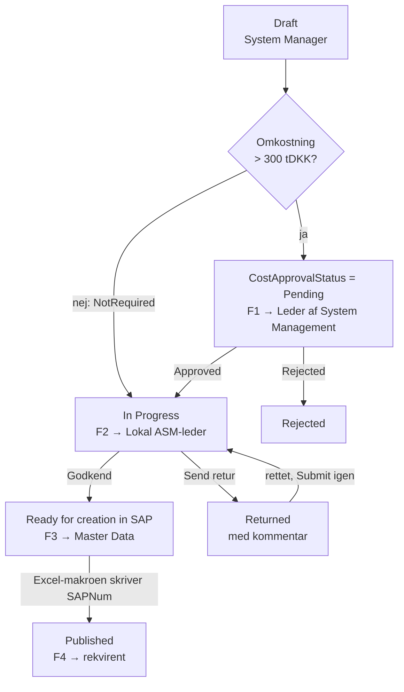

# Godkendelsesflow for nye VH-planer

> Status: **oplæg til review**. Grundlaget er procesdiagrammet *Opret ny
> VH-plan for eksisterende anlæg (BIO-DK)*, niveau 4, ændret 17-09-2026.
> Åbne spørgsmål står i §9. Intet her er bygget endnu.

## 1. Kort svar: kan det sættes op ud fra SharePoint-listerne?

**Ja, men ikke med SharePoints indbyggede godkendelse.** Det skal være
Power Automate-flows, der trigges af ændringer i `MaintenancePlans`.

SharePoints egen *Configure approvals* på en liste er ét trin med faste
godkendere. Den kan ikke:

- vælge godkender ud fra et beløb (> 300 tDKK → Leder af System Management),
- køre to trin efter hinanden med forskellige roller (leder, så ASM-leder,
  så Master Data Specialist),
- vælge godkender pr. værk,
- sende en sag retur med en kommentar, så den kan rettes og sendes igen.

Den lægger desuden sine egne kolonner på listen, som ikke kan slettes igen
fra brugerfladen. `MaintenancePlans` har allerede opslagskolonner nok.

Det, der **kan** bruges fra SharePoint-siden, er triggeren *When an item is
created or modified* på `MaintenancePlans` med **trigger conditions**. Så er
`Status`-kolonnen, som appen allerede skriver, det der styrer flowet, og
appen skal ikke kende til flowene.

Godkendelserne sendes med Power Automates **Approvals**-connector. De lander
i Teams (Approvals-appen) og som mail med knapper, og der er historik på
hvem der svarede hvad og hvornår.

## 2. Processen, som diagrammet beskriver den

| # | Aktivitet | Rolle | Gren |
|---|---|---|---|
| 1 | Behov for ny VH-plan | (udløses af andre processer) | |
| 2 | Vurder hvornår planen oprettes | System Manager | **ONE:** dato efter 1/8 og omkostning > 200 tDKK → *ZEXO NIR nødvendig* → *Håndter nye identificerede risici* (processen stopper her). Ellers → 3 |
| 3 | Vurder omkostningerne ved VH-opgaven | System Manager | **ONE:** < 300 tDKK → 5. > 300 tDKK → 4 |
| 4 | Send til godkendelse → **Godkend ny VH-plan** | Leder af System Management | → 5 |
| 5 | Beslut hvordan VH-planen skal kaldes | System Manager | **ONE:** datapunkt → *Opret datapunkt* (anden proces) → venter på *Målepunkt til rådighed*. Tidsbaseret → 6 |
| 6 | Beskriv ny VH-plan | System Manager | **ALL:** 7 og 8 kører parallelt |
| 7 | Vurder behov for ny servicekontrakt | System Manager | Hvis ja → *Opret ny serviceaftale* (anden proces). Blokerer ikke |
| 8 | **Gennemgå kvaliteten af den nye VH-plan** | Lokal ASM Leder | → 9 |
| 9 | Anmod om oprettelse i SAP | System Manager | → 10 |
| 10 | **Opret ny VH-plan i SAP** | Master Data Specialist SAP | → 11 |
| 11 | Informer rekvirent om at VH-planen er oprettet | System Manager | **ONE:** planlægning påkrævet / ingen planlægning (begge uden for appen) |

Tre ting i diagrammet er **ikke beslutninger, men porte**, som appen kan
håndhæve selv uden et flow: ZEXO NIR-stoppet (2), valget af kaldetype (5)
og servicekontrakten (7). De egentlige godkendelser er to: **omkostning**
(4) og **kvalitet** (8). Trin 10 er en opgave, ikke en godkendelse.

**Diagrammet viser kun den glade vej.** Der er ingen pil for "leder
afviser" eller "ASM-leder sender retur". Det skal besluttes (§9), men
oplægget her antager, at begge kan sende sagen **retur til System
Manager** med en kommentar, og at lederen også kan **afvise** endeligt.

## 3. Statusmodellen

`MaintenancePlans.Status` har allerede de fire værdier, hovedforløbet skal
bruge, og Excel-makroen (`Update_Sharepoint_Lists.bas`) sætter allerede
`Published` og `SAPNum`, når planen er oprettet i SAP:

| `MaintenancePlans.Status` | Betyder i det nye forløb | `MD_RequestIndex.Status` | Step |
|---|---|---|:-:|
| `Draft` | System Manager arbejder på planen | `Kladde` | 1 |
| `In Progress` | Sendt til kvalitetsgennemgang hos lokal ASM-leder (trin 8) | `Indsendt` (appen), derefter `UnderBehandling` (F2, når godkendelsen er sendt) | 2 → 3 |
| `Ready for creation in SAP` | Godkendt af ASM, ligger hos Master Data (trin 10) | `KlarTilSAP` | 4 |
| `Published` | Oprettet i SAP, `SAPNum` udfyldt (trin 11) | `OprettetISAP` | 5 |
| **`Returned`** *(ny)* | Sendt retur med kommentar – kan rettes og indsendes igen | `AfventerInfo` | – |
| **`Rejected`** *(ny)* | Afvist endeligt | `Afvist` | – |

Omkostningsgodkendelsen er **ikke** en værdi i `Status`. Den kører på sin
egen kolonne, `CostApprovalStatus`, fordi den i processen ligger *før* planen
er beskrevet (trin 4 før trin 6). Så kan System Manager bede om
godkendelsen, så snart beløbet og begrundelsen er kendt, og arbejde videre
på planen i mellemtiden. Appen tillader først **Submit** (→ `In Progress`),
når omkostningen er afklaret.



Pilen fra `Draft` til `In Progress` er **Submit** i appen. Den er spærret,
indtil omkostningen er `NotRequired` eller `Approved`.

## 4. Nye kolonner

### `MaintenancePlans`

Tekst og tal frem for Person og Lookup, af samme grund som i resten af
datamodellen (`02-datamodel-sharepoint.md`): de kan filtreres delegerbart og
bruges i trigger conditions.

| Kolonne | Type | Skrives af | Bemærkning |
|---|---|---|---|
| `EstimatedCostTdkk` | Number | App | Forslag = sum af operationernes `Price` / 1000. System Manager kan rette |
| `CostJustification` | Note (plain) | App | Begrundelsen lederen ser i godkendelsen |
| `ZexoNirRequired` | Yes/No | App | Resultatet af trin 2. Ja → Submit er spærret |
| `CallType` | Choice `Time`, `DataPoint` | App | Trin 5 |
| `MeasuringPoint` | Text | App | SAP-målepunkt. Påkrævet før Submit, når `CallType = DataPoint` |
| `ServiceContractNeeded` | Yes/No | App | Trin 7 |
| `ServiceContractNote` | Note | App | |
| `RequisitionerEmail` | Text Ⓘ | App | **Rekvirenten** (trin 11) – ikke nødvendigvis den, der udfylder appen |
| `CostApprovalStatus` | Choice `NotRequired`, `Pending`, `Approved`, `Rejected` Ⓘ | App sætter `NotRequired`/`Pending`, **kun flow** sætter resten | |
| `CostApprovalId` | Text | Flow | Id på den åbne godkendelse. Spærre mod dobbeltkørsel, se §5 |
| `ReviewApprovalId` | Text | Flow | Samme for kvalitetsgennemgangen |
| `ReturnComment` | Note | Flow | Seneste kommentar fra leder eller ASM-leder. Vises i appen |
| `RequisitionerNotified` | Yes/No | Flow | Spærre, så rekvirenten kun får én mail |

Status-kolonnen får to nye valg: `Returned` og `Rejected`.

### `MD_ApprovalRole` *(ny liste)* – hvem godkender hvad på hvilket værk

| Kolonne | Type | Bemærkning |
|---|---|---|
| `Title` → `Role` | Text Ⓘ | `LederSystemManagement`, `LokalAsmLeder`, `MasterDataSap`, `ServiceContract` |
| `Plant` | Text(4) Ⓘ | Tom = gælder alle værker |
| `ApproverEmail` | Text | Én person eller en mailaktiveret gruppe |
| `IsActive` | Yes/No Ⓘ | |

Flowet slår op med `Role` + værk og falder tilbage på rækken uden værk. Så
kan godkendere skiftes uden at røre flowet. `UserAndGroups` kunne udvides i
stedet, men den bruges til admin-adgang, og de to formål bør ikke blandes.

### `MD_ApprovalLog` *(ny liste)* – revisionsspor

| Kolonne | Type |
|---|---|
| `RequestGuid` | Text Ⓘ |
| `Domain` | Text | 
| `Step` | Text (`Cost`, `Review`, `SapCreated`) |
| `Decision` | Text (`Approve`, `Return`, `Reject`) |
| `DecidedByEmail` / `DecidedOn` | Text / DateTime |
| `Comment` | Note |

Brugerne har **kun læseadgang**; flowene skriver med en serviceforbindelse.
Det er vigtigt, fordi SharePoint-connectoren i appen kører som brugeren: en
bruger med skriveadgang til `MaintenancePlans` kan i princippet sætte
`CostApprovalStatus = Approved` selv. Kvalitetsflowet (F2) tjekker derfor
loggen, ikke kun kolonnen.

### Grænseværdier i `AppSettings`

`AppSettings` har allerede `Option`/`Value` pr. miljø. Tre nye rækker, så
beløbene kan ændres uden en ny app-version:

| `Option` | `Value` |
|---|---|
| `CostApprovalThresholdTdkk` | `300` |
| `ZexoNirThresholdTdkk` | `200` |
| `ZexoNirCutoffMonthDay` | `0801` |

## 5. Flowene

Alle fire trigges af **SharePoint – When an item is created or modified** på
`MaintenancePlans` og adskilles af deres trigger condition. Fælles for dem:

- **Trigger condition + Id-kolonne som spærre.** Flowet skriver første
  gang et Id i sin egen kolonne. Den ændring trigger flowet igen, men nu er
  betingelsen falsk, så der opstår ingen løkke. Uden spærren ville hver
  gang System Manager gemmer en kladde under en åben godkendelse sende en ny
  godkendelse.
- **Concurrency = 1** på triggeren og et `Get item` som første handling, så
  to hurtige gem ikke starter to kørsler på en forældet version.
- **Create an approval + Wait for an approval**, ikke *Start and wait*. Så
  kan Id'et skrives på rækken, før der ventes.
- **Timeout.** Et flow kan højst køre 30 dage, inkl. ventende godkendelser.
  Sæt timeout på *Wait* til `P14D`. Ved timeout sendes en påmindelse, og
  Id-kolonnen tømmes. Så starter flowet forfra af sig selv med en ny
  godkendelse.
- **Indeksrækken.** Hvert flow opdaterer `MD_RequestIndex` (`Status`,
  `StatusStep`, `IsOpen`, `LastActionOn/By`) og sætter `AssignedToEmail` til
  den, sagen ligger hos. Så dukker den op i hubbens *Til behandling* hos den
  rigtige person, og i *Mine indmeldinger* kan System Manager se, hvor den
  er.
- **Serviceforbindelse.** Flowene ejes af en servicekonto (eller et
  solution-flow med connection references), ikke af en navngiven bruger.

### F1 `BioSap-VhPlan-CostApproval` – trin 4

```
@and(
  equals(triggerOutputs()?['body/CostApprovalStatus/Value'], 'Pending'),
  empty(triggerOutputs()?['body/CostApprovalId'])
)
```

1. `Get items` i `MD_ApprovalRole`: `Role eq 'LederSystemManagement'` og værk.
2. `Create an approval`, type **Approve/Reject – First to respond**. Detaljer
   i Markdown: plan, værk, beløb, begrundelse, link til appen med `?reqid=`.
3. `Update item`: `CostApprovalId` = godkendelsens navn.
4. `Wait for an approval` (timeout `P14D`).
5. Godkendt → `CostApprovalStatus = Approved`. Afvist →
   `CostApprovalStatus = Rejected`, `Status = Rejected`, `ReturnComment`.
6. Række i `MD_ApprovalLog`, opdatér indeksrækken, mail til System Manager.

### F2 `BioSap-VhPlan-QualityReview` – trin 8 (og 7)

```
@and(
  equals(triggerOutputs()?['body/Status/Value'], 'In Progress'),
  empty(triggerOutputs()?['body/ReviewApprovalId'])
)
```

1. **Værn:** er `EstimatedCostTdkk` over grænsen, og findes der ingen
   `Approve`-række for `Step = Cost` i `MD_ApprovalLog` → `Status =
   Returned` med forklaring, og stop.
2. Er `ServiceContractNeeded` ja → mail til rollen `ServiceContract`
   (trin 7). Blokerer ikke resten, ligesom `ALL`-grenen i diagrammet.
3. `Create an approval` til `LokalAsmLeder` for værket, type **Custom
   Responses – Wait for one response** med svarene *Godkend* og *Send
   retur*.
4. *Godkend* → `Status = Ready for creation in SAP`. *Send retur* →
   `Status = Returned`, `ReturnComment` = kommentaren, `ReviewApprovalId`
   tømmes, så en ny indsendelse starter en ny gennemgang.
5. Log, indeksrække, mail.

### F3 `BioSap-VhPlan-ToMasterData` – trin 9 og 10

```
@and(
  equals(triggerOutputs()?['body/Status/Value'], 'Ready for creation in SAP'),
  not(equals(triggerOutputs()?['body/InitialEmailSent'], true))
)
```

Det er den mail, der allerede er designet i
[`17-flow-email.md`](17-flow-email.md) (*"VH-plan … sendt til
oprettelse"*). Den flyttes blot fra `In Progress` til `Ready for creation in
SAP`, går til rollen `MasterDataSap`, og sætter `InitialEmailSent = true`,
som listen allerede har.

Trin 10 er **ikke** en godkendelse i Approvals. Master Data opretter planen
med Excel-makroen, som i forvejen skriver `SAPNum` og `Status = Published`
tilbage. En godkendelsesknap ville kun være et ekstra klik, og den kan ikke
tage imod plannummeret.

### F4 `BioSap-VhPlan-Created` – trin 11

```
@and(
  equals(triggerOutputs()?['body/Status/Value'], 'Published'),
  not(equals(triggerOutputs()?['body/RequisitionerNotified'], true))
)
```

Mail til `RequisitionerEmail` (og System Manager på cc) med `SAPNum`. Sæt
`RequisitionerNotified = true`, log, indeksrækken → `OprettetISAP`,
`SapObjectNo = SAPNum`, `IsOpen = false`.

Valget *planlægning påkrævet / ingen planlægning* sker i SAP og hører ikke
til appen.

## 6. Ændringer i appen

Alt sker i builderne i `Maintenance Plan App/build/`. Kolonnenavnene lægges
i `sp_config.py`, som alle andre.

| Hvor | Ændring |
|---|---|
| Nyt kort *Approval* (trin 1–2 i trinindikatoren) | `EstimatedCostTdkk` (forslag fra operationerne), `CostJustification`, ZEXO NIR-spørgsmålet, `CallType` + `MeasuringPoint`, `ServiceContractNeeded`, rekvirent |
| Knap *Request cost approval* | Kun synlig over grænsen og når `CostApprovalStatus` er tom eller `NotRequired`. Gemmer og sætter `Pending` |
| `btnVhpSubmit.DisplayMode` (`build_save.py`) | Deaktiveret, medmindre: ingen ZEXO NIR, omkostning `NotRequired`/`Approved`, og målepunkt udfyldt ved `DataPoint` |
| Statusbanner i toppen | Viser hvor sagen er, hvem den ligger hos, og `ReturnComment`, når den er sendt retur |
| Skrivebeskyttelse | Alle felter er låst, når `Status` ikke er `Draft` eller `Returned` |
| `save_action` | Skriver de nye app-felter. Skriver **aldrig** `CostApprovalStatus = Approved`, `*ApprovalId` eller `ReturnComment` |
| `save_action(submit=True)` | Uændret: `Status = In Progress` og indeksrækken `Indsendt`/2. Ved genindsendelse fra `Returned` tømmes `ReturnComment` ikke – den er historik, loggen har resten |

ZEXO NIR-stoppet (trin 2) bliver en valideringsregel på samme måde som
S1–S5: *"Planlagt start efter 1/8 og omkostning over 200 tDKK kræver en ZEXO
NIR. Håndtér det i risikoprocessen, før planen indmeldes."*

## 7. Hubben

*Til behandling* filtrerer i forvejen på `AssignedToEmail`. Når flowene
sætter feltet, får ledere, ASM-ledere og Master Data en kø uden ekstra
arbejde i hubben. De kan også svare direkte fra Teams eller mailen, så
hubben er et overblik og ikke det eneste sted, man kan godkende.

## 8. Rækkefølge

| Fase | Indhold | Hvorfor i den rækkefølge |
|---|---|---|
| 1 | PnP-script: nye kolonner, to valg i `Status`, `MD_ApprovalRole`, `MD_ApprovalLog`, `AppSettings`-rækker | Alt andet afhænger af det |
| 2 | F2 + F3 + F4 | Dækker kvalitetsgennemgang og SAP-oprettelse på de statusværdier, appen **allerede** skriver. Kan testes uden appændringer |
| 3 | Appen: statusbanner, låsning, *Returned*-forløbet | Uden den kan System Manager ikke se en returkommentar |
| 4 | F1 + omkostningsfelterne og knappen i appen | |
| 5 | ZEXO NIR, kaldetype/målepunkt, servicekontrakt | Porte i appen, ingen nye flows |

Test hver fase i DEV med to testbrugere i rollerne, så det er tydeligt,
hvem der modtager hvad.

## 9. Åbne spørgsmål

1. **200 eller 300 tDKK?** ZEXO NIR-grenen siger > 200 tDKK, omkostningsgrenen
   > 300 tDKK. Er det to forskellige grænser med vilje?
2. **Hvad er "1/8"?** 1. august i indeværende budgetår, målt på planens
   første forfaldsdato (`PlannedDate`)? Etiketten i diagrammet er afkortet
   ("… >200tDKK..."). Hvad står der resten af?
3. **Hvilken omkostning?** Pr. udførelse, pr. år eller over planens
   levetid? Og tæller materialer og ekstern leverandør med? Svaret afgør,
   om forslaget kan regnes ud af operationerne.
4. **Afvisning.** Diagrammet har ingen afvisningsgren. Må lederen afvise
   endeligt, eller kun sende retur? Må ASM-lederen afvise?
5. **Rekvirent vs. System Manager.** Er "rekvirenten" i trin 11 en anden
   person end den, der udfylder appen?
6. **Godkendere.** Er Leder af System Management én person for hele BIO,
   eller én pr. værk? Samme spørgsmål for lokal ASM-leder og Master Data.
   Skal Master Data være en fælles gruppe, hvor den første tager sagen?
7. **Servicekontrakt.** Hvem ejer *Opret ny serviceaftale*, og er en mail
   nok, eller skal det være en opgave med kvittering?
8. **Datapunkt.** Skal VH-plan-appen vente på en indmelding i
   målepunktsappen (samme `MD_RequestIndex`), eller er det nok, at System
   Manager skriver målepunktsnummeret, når det findes?
9. **Eksisterende planer.** De 41 rækker i `MaintenancePlans` har ingen af
   de nye felter. Skal de i `In Progress` i dag igennem kvalitetsgennemgang,
   eller markeres de som gennemgået ved idriftsættelsen?
