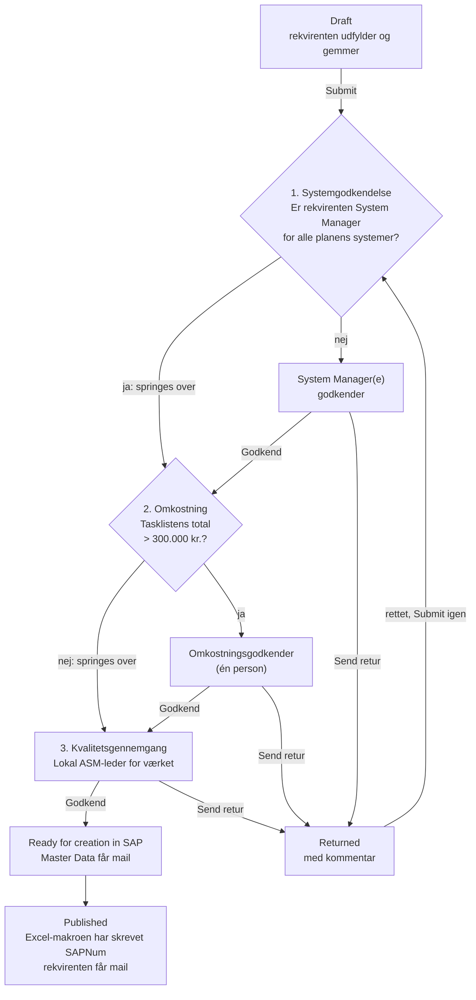

# Godkendelsesflow for nye VH-planer

> Status: **oplæg, rettet efter første review**. Grundlaget er procesdiagrammet
> *Opret ny VH-plan for eksisterende anlæg (BIO-DK)*, niveau 4, ændret
> 17-09-2026. Beslutningerne fra reviewet står i §2. Det, der stadig er åbent,
> står i §11. Intet her er bygget endnu.

## 1. Kort svar: kan det sættes op ud fra SharePoint-listerne?

**Ja, men ikke med SharePoints indbyggede godkendelse.** Det skal være
Power Automate-flows, der trigges af ændringer i `MaintenancePlans`.

SharePoints egen *Configure approvals* på en liste er ét trin med faste
godkendere. Den kan ikke:

- vælge godkender ud fra planens systemer, beløb eller værk,
- køre flere trin efter hinanden med forskellige roller,
- slå noget op i en Power BI-model,
- sende en sag retur med en kommentar, så den kan rettes og sendes igen.

Den lægger desuden sine egne kolonner på listen, som ikke kan slettes igen
fra brugerfladen.

Det, der **kan** bruges fra SharePoint-siden, er triggeren *When an item is
created or modified* på `MaintenancePlans` med **trigger conditions**. Så er
det kolonner på planen, som appen og flowene skriver, der styrer forløbet.
Godkendelserne sendes med Power Automates **Approvals**-connector. De lander
i Teams (Approvals-appen) og som mail med knapper, og der er historik på,
hvem der svarede hvad og hvornår.

## 2. Beslutninger fra reviewet

| # | Beslutning | Betyder for løsningen |
|---|---|---|
| 1 | Kun **300.000 kr.** er en grænse. Godkendelsen sker **efter planen er gemt**, og det er **tasklistens samlede omkostning**, der sammenlignes med. Grænsen skal være en parameter | Flowet regner summen af operationernes `Price` i `TaskListMain` ud selv. Grænsen står i `AppSettings` |
| 2 | ZEXO NIR og "dato efter 1/8" udgår | Ingen port for det i appen |
| 3 | Omkostningen er **pr. udførelse** | Summen af én gennemførelse af tasklisten, ikke ganget med cyklusser |
| 4 | Godkendere kan kun **sende retur**, ikke afvise endeligt | Ingen `Rejected`-status. Alle trin ender i *Godkend* eller *Send retur* |
| 5 | Omkostning godkendes af **én person**. Kvalitet godkendes **pr. værk** | To rækketyper i `MD_ApprovalRole` |
| 6 | Den, der udfylder appen, **er rekvirenten**. Er det ikke en System Manager, skal **System Manageren for systemet** godkende. Systemet bestemmes af Functional Location og slås op i flowet i en **Power BI semantisk model** | Nyt første trin: systemgodkendelse. Rekvirenten er planens opretter; der kommer ikke et ekstra felt |

"Efter planen er gemt" er her læst som **Submit**. Godkendelsen starter
altså ikke ved hver *Save draft*. En kladde gemmes mange gange, og hver
gang skrives operationerne forfra. Derfor ville beløbet ændre sig under en
åben godkendelse.

## 3. Forløbet



Sammenholdt med procesdiagrammet: trin 1 er nyt og erstatter, at System
Manageren selv udfylder. Trin 2 og 3 er diagrammets *Godkend ny VH-plan* og
*Gennemgå kvaliteten af den nye VH-plan*. Rækkefølgen er vendt, så
omkostningen godkendes efter planen er beskrevet: det er først der, at
tasklisten og dermed beløbet findes. *Opret ny VH-plan i SAP* er ikke en
godkendelse, men en opgave hos Master Data. Den afsluttes af Excel-makroen,
som allerede skriver `SAPNum` og `Status = Published` tilbage.

## 4. Statusmodellen

`MaintenancePlans.Status` bevarer sine fire værdier og får én ny.
Undervejs i godkendelserne står planen i `In Progress`. Det trin, den er
nået til, står i en ny kolonne, `ApprovalStage`.

| `Status` | `ApprovalStage` | Ligger hos | `MD_RequestIndex.Status` | Step |
|---|---|---|---|:-:|
| `Draft` | *(tom)* | Rekvirenten | `Kladde` | 1 |
| `In Progress` | `System` | System Manager(e) | `Indsendt` → `UnderBehandling` | 2 → 3 |
| `In Progress` | `Cost` | Omkostningsgodkender | `UnderBehandling` | 3 |
| `In Progress` | `Quality` | Lokal ASM-leder | `UnderBehandling` | 3 |
| `Ready for creation in SAP` | `Done` | Master Data | `KlarTilSAP` | 4 |
| `Published` | `Done` | – | `OprettetISAP` | 5 |
| **`Returned`** *(ny)* | *(tom)* | Rekvirenten | `AfventerInfo` | – |

Hvorfor en ekstra kolonne og ikke flere statusværdier: Excel-makroen,
hubben og den eksisterende mail kender allerede de fire værdier. Tre nye
"In Progress"-varianter ville skulle læres alle tre steder. `ApprovalStage`
læses kun af flowene og appens statusbanner.

## 5. Nye kolonner og lister

Tekst og tal frem for Person og Lookup, af samme grund som i resten af
datamodellen (`02-datamodel-sharepoint.md`): de kan filtreres delegerbart og
bruges i trigger conditions.

### `MaintenancePlans`

| Kolonne | Type | Skrives af | Bemærkning |
|---|---|---|---|
| `ApprovalStage` | Choice `System`, `Cost`, `Quality`, `Done` Ⓘ | App sætter `System` ved Submit. Flowene sætter resten | |
| `SubmittedOn` | DateTime | App ved Submit | Afgrænser "denne indsendelse" i loggen, se §6.3 |
| `ApprovalId` | Text | Flow | Id på den åbne godkendelse. Spærre mod dobbeltkørsel, se §6 |
| `TaskListTotalCost` | Number | Flow | Summen, flowet regnede ud ved trin 2. Vises i appen og i godkendelsen |
| `CostApprovedAmount` | Number | Flow | Det beløb, der blev godkendt. Bruges ved genindsendelse, se §6.2 |
| `ApprovedSystems` | Text | Flow | `;SYS1;SYS2;`, de systemer, der er godkendt. Bruges ved genindsendelse, se §6.1 |
| `ReturnComment` | Note | Flow | Seneste kommentar ved *Send retur*. Vises i appen |
| `RequesterNotified` | Yes/No | Flow | Spærre, så rekvirenten kun får én mail ved oprettelsen |

`Status` får valget `Returned`.

### `MD_ApprovalRole` *(ny liste)*

| Kolonne | Type | Bemærkning |
|---|---|---|
| `Title` → `Role` | Text Ⓘ | `CostApprover` eller `LokalAsmLeder` (og `MasterDataSap` til mailen) |
| `Plant` | Text(4) Ⓘ | Tom for `CostApprover` og `MasterDataSap`. Udfyldt for `LokalAsmLeder` |
| `ApproverEmail` | Text | Én person, eller en mailaktiveret gruppe for Master Data |
| `IsActive` | Yes/No Ⓘ | |

System Managerne står **ikke** her. De kommer fra Power BI-modellen (§7).

### `MD_ApprovalLog` *(ny liste)* – revisionsspor

| Kolonne | Type |
|---|---|
| `RequestGuid` | Text Ⓘ |
| `PlanId` | Number Ⓘ |
| `Stage` | Text (`System`, `Cost`, `Quality`, `SapCreated`) |
| `Decision` | Text (`Approve`, `Return`, `Skipped`) |
| `DecidedByEmail` / `DecidedOn` | Text / DateTime |
| `Detail` | Text – fx systemnavnet eller beløbet |
| `Comment` | Note |

Brugerne har **kun læseadgang**. Flowene skriver med en serviceforbindelse.
Det er vigtigt, fordi SharePoint-connectoren i appen kører som brugeren: en
bruger med skriveadgang til `MaintenancePlans` kan i princippet selv sætte
`ApprovalStage = Quality`. Kvalitetsflowet tjekker derfor loggen, før det
sender noget videre (§6.3).

`Skipped` logges også, med grunden i `Detail` ("rekvirent er System
Manager", "total 184.200 kr."). Så kan man bagefter se, *hvorfor* et trin
ikke blev godkendt af nogen.

### Parametre i `AppSettings`

`AppSettings` har allerede `Option`/`Value` pr. miljø.

| `Option` | `Value` |
|---|---|
| `CostApprovalThresholdDkk` | `300000` |

## 6. Flowene

Tre godkendelsesflows, ét pr. trin, og to mailflows. Alle trigges af
**SharePoint – When an item is created or modified** på `MaintenancePlans`.

**Hvorfor ét flow pr. trin og ikke ét langt:** et flow kan højst køre 30
dage, inklusive ventende godkendelser. Tre godkendelser efter hinanden kan
ramme det. Med ét flow pr. trin starter hver ventetid forfra.

Fælles for dem:

- **Trigger condition + `ApprovalId` som spærre.** Flowet skriver et Id i
  `ApprovalId`, så snart det starter. Den ændring trigger flowet igen, men nu
  er betingelsen falsk, så der opstår ingen løkke. Uden spærren ville hver
  ændring på planen under en åben godkendelse sende en ny.
- **Concurrency = 1** på triggeren og et `Get item` som første handling.
- **Næste trin:** ved *Godkend* (eller når trinnet springes over) sætter
  flowet `ApprovalStage` til næste trin og tømmer `ApprovalId`. Det trigger
  næste flow.
- **Send retur:** `Status = Returned`, `ApprovalStage` tømmes,
  `ReturnComment` = kommentaren, mail til rekvirenten.
- **Create an approval + Wait for an approval**, ikke *Start and wait*. Så
  kan Id'et skrives på rækken, før der ventes.
- **Timeout** `P14D` på *Wait*. Ved timeout: påmindelse, og `ApprovalId`
  tømmes. Så starter samme flow forfra med en ny godkendelse.
- **Indeksrækken:** hvert flow opdaterer `MD_RequestIndex` og sætter
  `AssignedToEmail` til den, sagen ligger hos (§9).
- **Log:** én række i `MD_ApprovalLog` pr. beslutning og pr. overspringning.
- **Ejer:** en servicekonto eller et solution-flow med connection
  references, ikke en navngiven bruger.

Godkendelsestypen er **Approve/Reject – Everyone must approve** i alle tre.
*Reject* betyder *Send retur*, og det står i godkendelsens tekst. Typen
stopper ved første afvisning, og det er præcis, hvad *Send retur* skal.

### 6.1 F1 `BioSap-VhPlan-SystemApproval`

```
@and(
  equals(triggerOutputs()?['body/Status/Value'], 'In Progress'),
  equals(triggerOutputs()?['body/ApprovalStage/Value'], 'System'),
  empty(triggerOutputs()?['body/ApprovalId'])
)
```

1. `Get items` på `MaintenanceItems` med `MaintenancePlanNo/Id eq <ID>`.
   Saml de forskellige `FunctionalLocation`.
2. Slå systemer og System Managere op i Power BI-modellen (§7).
3. Fjern de systemer, hvor rekvirenten (planens *Created By*) selv er
   System Manager, og de systemer, der allerede står i `ApprovedSystems`.
4. Er der ingen tilbage → log `Skipped`, `ApprovalStage = Cost`, stop.
5. Ellers: én godkendelse til de tilbageværende System Managere, med en
   linje pr. system og de FL'er, der ligger under det.
6. *Godkend* → systemerne lægges i `ApprovedSystems`, `ApprovalStage = Cost`.

Punkt 3 gør, at en genindsendelse efter *Send retur* ikke sender samme
godkendelse igen, medmindre rekvirenten har tilføjet et FL på et nyt system.

Findes et FL ikke i modellen, sendes planen **retur** med forklaringen
"FL XYZ findes ikke i systemmodellen". Det må ikke glide igennem uden
godkendelse.

### 6.2 F2 `BioSap-VhPlan-CostApproval`

Samme trigger condition med `ApprovalStage = 'Cost'`.

1. `Get items` på `TaskListMain` med `MaintenancePlanID/Id eq <ID>`.
   Total = `sum` af `Price`. Skriv den i `TaskListTotalCost`.
2. Total ≤ `CostApprovalThresholdDkk` → log `Skipped` med beløbet,
   `ApprovalStage = Quality`, stop.
3. Total ≤ `CostApprovedAmount` (godkendt ved en tidligere indsendelse) →
   samme som punkt 2. Et godkendt beløb gælder, så længe planen ikke bliver
   dyrere.
4. Ellers: godkendelse til `CostApprover`. Detaljerne har total, grænse og
   de fem dyreste operationer.
5. *Godkend* → `CostApprovedAmount = TaskListTotalCost`,
   `ApprovalStage = Quality`.

Beløbet regnes af flowet og ikke af appen, så det er det gemte, der
godkendes, og ingen kan skrive et andet tal ind.

### 6.3 F3 `BioSap-VhPlan-QualityReview`

Samme trigger condition med `ApprovalStage = 'Quality'`.

1. **Værn:** findes der efter `SubmittedOn` ikke en `Approve`- eller
   `Skipped`-række for både `System` og `Cost` i `MD_ApprovalLog` → sæt
   `ApprovalStage = System` og stop. Så køres de to trin igen i stedet for at
   blive sprunget over.
2. Godkendelse til `LokalAsmLeder` for planens værk (`PlantsInitial`).
3. *Godkend* → `Status = Ready for creation in SAP`, `ApprovalStage = Done`.

### 6.4 F4 `BioSap-VhPlan-ToMasterData`

```
@and(
  equals(triggerOutputs()?['body/Status/Value'], 'Ready for creation in SAP'),
  not(equals(triggerOutputs()?['body/InitialEmailSent'], true))
)
```

Det er mailen fra [`17-flow-email.md`](17-flow-email.md) (*"VH-plan …
sendt til oprettelse"*). Den flyttes fra `In Progress` til `Ready for
creation in SAP`, går til `MasterDataSap` og sætter `InitialEmailSent =
true`, som listen allerede har.

### 6.5 F5 `BioSap-VhPlan-Created`

```
@and(
  equals(triggerOutputs()?['body/Status/Value'], 'Published'),
  not(equals(triggerOutputs()?['body/RequesterNotified'], true))
)
```

Mail til rekvirenten med `SAPNum`, `RequesterNotified = true`, log,
indeksrækken → `OprettetISAP`, `SapObjectNo = SAPNum`, `IsOpen = false`.

## 7. Opslaget i Power BI

Power BI-connectoren i Power Automate har handlingen **Run a query against
a dataset**. Den sender en DAX-forespørgsel til den semantiske model via
REST-API'et *Execute Queries* og får rækkerne tilbage som JSON.

### Forespørgslen

Tabel- og kolonnenavne nedenfor er pladsholdere, indtil modellen er kendt
(§11). FL-listen bygges i flowet af punkt 1 i §6.1.

```dax
EVALUATE
SELECTCOLUMNS (
    FILTER (
        'FunctionalLocation',
        'FunctionalLocation'[FunctionalLocation]
            IN { "SSV10 KAB10AP001", "SSV10 KAB10AP002" }
    ),
    "FL", 'FunctionalLocation'[FunctionalLocation],
    "System", 'FunctionalLocation'[System],
    "SystemManagerEmail", RELATED ( 'System'[SystemManagerEmail] )
)
```

Tre ting at vide:

- **Nøglerne i svaret har klammer.** Kolonnen `"System"` kommer tilbage som
  `[System]`, så i flowet hedder det `item()?['[System]']`.
- **Anførselstegn i et FL skal fordobles**, før det sættes ind i
  `IN { … }`: `replace(item(), '"', '""')`. Ellers kan et FL ødelægge
  forespørgslen.
- **Sammenlign e-mails med små bogstaver** (`toLower`), ligesom appen gemmer
  dem.

### Forudsætninger

| | |
|---|---|
| Tenant-indstilling | **Dataset Execute Queries REST API** (Developer settings) skal være slået til for flowets konto |
| Rettigheder | Flowets konto skal have **Build** og **Read** på den semantiske model |
| Grænser | 100.000 rækker og 1.000.000 værdier pr. forespørgsel. En plan har få FL'er, så det er langt fra |
| Kapacitet | Virker på Pro, PPU og Premium/Fabric |
| RLS | Har modellen row-level security, ser flowets konto kun sine egne rækker. Kontoen skal have adgang til alle systemer |

Modellen opdateres efter sin egen tidsplan. Et FL, der lige er oprettet i
SAP, er måske ikke kommet med endnu. Det er grunden til, at et ukendt FL
sender planen retur med en forklaring i stedet for at fejle stille.

## 8. Ændringer i appen

Alt sker i builderne i `Maintenance Plan App/build/`. Kolonnenavnene lægges
i `sp_config.py`, som alle andre.

| Hvor | Ændring |
|---|---|
| `save_action(submit=True)` (`build_save.py`) | Skriver også `ApprovalStage: { Value: "System" }` og `SubmittedOn: Now()`, og tømmer `ApprovalId`. Ved genindsendelse fra `Returned` gøres det samme |
| `save_action` | Skriver **aldrig** `ApprovalId`, `TaskListTotalCost`, `CostApprovedAmount`, `ApprovedSystems` eller `ReturnComment` |
| Statusbanner i toppen | Hvor sagen er (`ApprovalStage`), hvem den ligger hos, og `ReturnComment` ved `Returned` |
| Totalen i operationstabellen | Viser i dag summen **pr. item** (`conVhpOpsTotalsHtml`). Nyt: en linje med planens samlede sum og teksten "Over 300.000 kr. – kræver omkostningsgodkendelse", når den er over grænsen fra `AppSettings`. Kun information; flowet regner selv |
| Skrivebeskyttelse | Alle felter låses, når `Status` ikke er `Draft` eller `Returned` |
| Knapperne | *Save draft* og *Submit* er deaktiveret i samme tilfælde |

## 9. Hubben

*Til behandling* filtrerer i forvejen på `AssignedToEmail`. Når flowene
sætter feltet, får System Managere, omkostningsgodkenderen, ASM-lederne og
Master Data en kø uden ekstra arbejde i hubben. Ved flere System Managere
står den første i `AssignedToEmail`, og resten står i godkendelsen. De kan
også svare direkte fra Teams eller mailen.

## 10. Rækkefølge

| Fase | Indhold | Hvorfor i den rækkefølge |
|---|---|---|
| 1 | PnP-script: nye kolonner, `Returned` i `Status`, `MD_ApprovalRole`, `MD_ApprovalLog`, `AppSettings`-rækken | Alt andet afhænger af det |
| 2 | Adgang til Power BI-modellen: tenant-indstilling og Build-rettighed. Test DAX-forespørgslen i DAX query view | Den længste ventetid ligger typisk hos andre |
| 3 | F4 og F5 | Virker på statusværdier, appen og makroen allerede skriver |
| 4 | Appen: `ApprovalStage` ved Submit, statusbanner, låsning, `Returned` | |
| 5 | F2 og F3, derefter F1 | F1 afhænger af fase 2 |

Test i DEV med testbrugere i hver rolle og en testplan med FL'er på to
forskellige systemer.

## 11. Stadig åbent

1. **Power BI-modellen.** Hvilket workspace og hvilken model? Hvad hedder
   tabellen og kolonnerne for FL, system og System Manager? Ligger System
   Managerens e-mail i modellen, eller kun systemet (så skal der en liste
   system → System Manager ved siden af)?
2. **Match på FL.** Findes alle FL-niveauer i modellen, eller kun
   systemniveauet, så flowet skal matche på en del af FL'en?
3. **Flere systemer i én plan.** Oplægget antager, at **alle** berørte
   System Managere skal godkende. Er det rigtigt?
4. **Hele planen eller pr. item?** En plan kan have flere items, hver med
   sin egen taskliste. Oplægget sammenligner **summen for hele planen** med
   300.000 kr. Skal det i stedet være hver tasklist (item) for sig?
5. **Valuta.** `TaskListMain` har `Currency`. Er alle priser i DKK, eller
   skal der regnes om?
6. **Datakaldt plan og servicekontrakt** (diagrammets trin 5 og 7) er ikke
   med i oplægget. Skal appen have felter til dem, eller er de uden for
   appen?
7. **Eksisterende planer** i `In Progress` uden `ApprovalStage`: skal de
   igennem forløbet, eller markeres de `Done` ved idriftsættelsen?
8. **Omkostningsgodkenderen:** hvem er det, og hvem er stedfortræder ved
   ferie? Det står i `MD_ApprovalRole`, så det kan skiftes uden at røre
   flowet.
